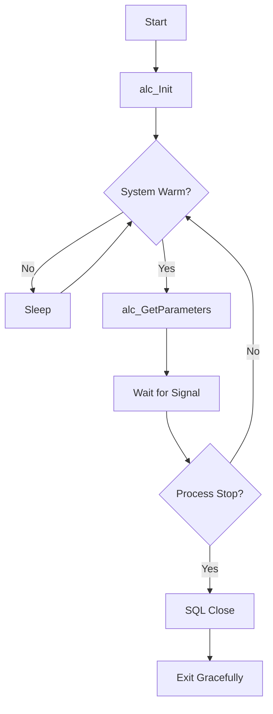

# p_ar_alloc (Stand Allocator)

**Document Version:** 1.0  
**Last Updated:** 2024-12-23  
**Author:** CmL  
**Source File:** `p_ar_alloc.cpp`  

---

## Overview

The Stand Allocator (`p_ar_alloc`) is a background process responsible for allocating work based on order requests. It monitors the system for unknown loads in the rack and full pallets ready for secondary processing.

---

## Purpose

- **Find Unknown Loads:** Identifies loads in the rack that have incomplete data and checks if data is now available
- **Find Full Pallets:** Locates pallets ready for the second process stage
- **Allocate Work:** Assigns work to stands based on order requirements
- **Orphan Pallet Detection:** Identifies pallets that have exceeded their time limit

---

## Location

- **Source:** `D:\ICIS\AuroDev\clogan\AuroDev\MSVC Programs\area\p_ar_alloc\p_ar_alloc.cpp`
- **Executable:** `D:\Auro\Exec\p_ar_alloc.exe`

---

## Process Flow



---

## Key Functions

### main()
```cpp
int main(long argc, char *argv[])
```
**Purpose:** Entry point for the allocator process  
**Flow:**
1. Initialize via `alc_Init()`
2. Enter main loop checking `cc_prc.check()`
3. If system is warm, get parameters and wait for signal
4. On stop signal, close SQL and exit

### alc_Init()
```cpp
void alc_Init(long argc, char* argv[])
```
**Purpose:** Initialize process components  
**Operations:**
1. Call `cs_init()` for common initialization
2. Connect to database via `ds_sql_connect()`
3. Clear elements table entries via `cs_elt_clear()`

**Parameters:**
| Parameter | Type | Description |
|-----------|------|-------------|
| argc | long | Argument count |
| argv | char*[] | Argument values |

**Return:** None (exits on failure)

### alc_GetParameters()
```cpp
void alc_GetParameters()
```
**Purpose:** Retrieve configuration parameters from the ELEM table  
**Operations:**
1. Get sleep time via `cs_tim_get()`
2. Query ELEM table for modified parameters since last check
3. Update local configuration variables

**Parameters Retrieved:**
| Parameter | Type | Description |
|-----------|------|-------------|
| Max_ToolTime | Integer | Maximum tool processing time |
| Orphan_Pallet_Time | Integer | Time before pallet is considered orphaned |

---

## Dependencies

| Dependency | Type | Purpose |
|------------|------|---------|
| `cc_str` | Library | String operations |
| `cc_prc` | Library | Process control |
| `cc_gg` | Library | Global variables |
| `cc_sys` | Library | System status |
| `cc_route` | Library | Route calculations |
| `cc_stk` | Library | Stacker operations |
| `cc_std` | Library | Stand operations |
| `cs_func` | Library | Common functions |
| `cs_elt` | Library | Element table access |
| `cs_log` | Library | Logging |
| `cs_tim` | Library | Timer functions |
| `ds_sql` | Library | SQL database interface |

---

## Database Tables Accessed

| Table | Operation | Purpose |
|-------|-----------|---------|
| MHC_ELEM | SELECT | Configuration parameters |
| MHC_LOAD | SELECT | Load information |
| MHC_INVT | SELECT | Inventory information |

---

## Shared Memory Usage

| Memory Block | Read/Write | Purpose |
|--------------|------------|---------|
| System Control | Read | Check warm start status |
| Process Control | Read | Check stop signal |

---

## Configuration Parameters

Configuration is read from the `MHC_ELEM` table with `Item_Area = 'Allocator'`:

| Parameter | Type | Default | Description |
|-----------|------|---------|-------------|
| Max_ToolTime | Integer | 0 | Maximum time for tool processing |
| Orphan_Pallet_Time | Integer | 0 | Time threshold for orphan detection |

---

## Error Handling

| Error Condition | Handling | ELT Code |
|-----------------|----------|----------|
| Database connection failure | Exit process | N/A |
| Missing ELEM record | Log information ELT | GM_ORA_RECNOTFOUND |
| Parameter not found | Use default value | GM_ORA_RECNOTFOUND |

---

## Logging

Uses `cs_log_printf()` with the following log levels:

| Level | Message Type | Example |
|-------|--------------|---------|
| 0 | Startup/Shutdown | "p_ar_alloc: Starting" |
| 9 | Debug | "Sleeping", "Wake Up" |

---

## Project History

| Date | Author | Change |
|------|--------|--------|
| 2010-10-15 | Craig | Initial version for HondaHT Project |
| 2011-03-02 | Craig | Updated for CAPT Project |
| 2022-11-07 | Patrick | Repurposed for CatNC |
| 2023-10-26 | Patrick | Repurposed for TBMNC |

---

## Related Documents

- [Process Index](00_Process_Index.md)
- [p_ar_fndwk](p_ar_fndwk.md) - Find Work
- [p_ar_movdp](p_ar_movdp.md) - Move Dispatcher
- [cs_elt Module](../03_Shared_Libraries/03_CSUB/cs_elt.md)

---

## Cross-References

| Topic | Document | Section |
|-------|----------|---------|
| Element Table | [Database Reference](../../04_Database_Reference/) | MHC_ELEM |
| Process Control | [cc_prc](../03_Shared_Libraries/02_CCSUB/cc_prc.md) | Process Management |
| System Status | [cc_sys](../03_Shared_Libraries/02_CCSUB/cc_sys.md) | Warm Start |

---

## Changelog

| Version | Date | Changes |
|---------|------|---------|
| 1.0 | 2024-12-23 | Initial documentation |


