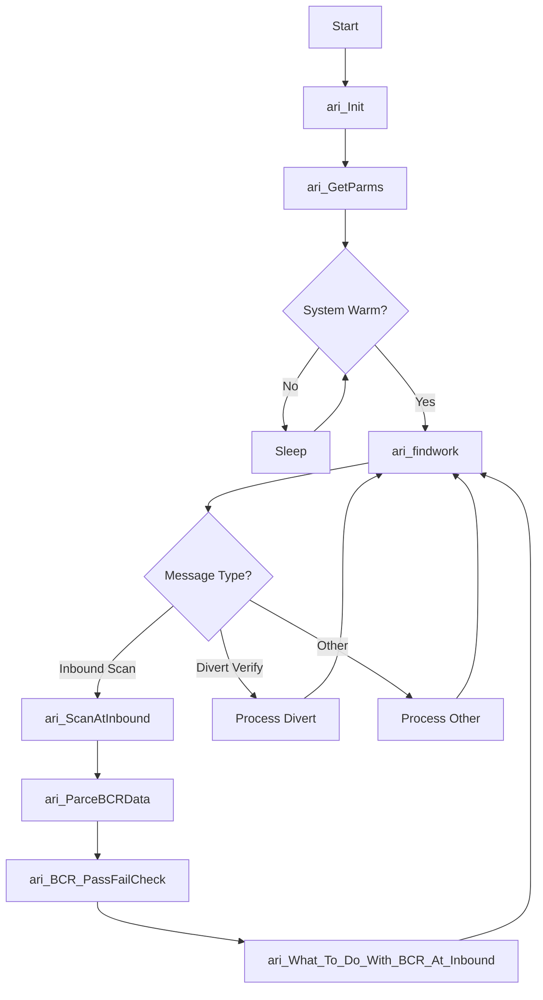

# p_ar_arive (Load Arrival Handler)

**Document Version:** 1.0  
**Last Updated:** 2024-12-23  
**Author:** CmL  
**Source File:** `p_ar_arive.cpp`  

---

## Overview

The Load Arrival Handler (`p_ar_arive`) is a critical background process responsible for processing load arrivals on the conveyor system. It handles barcode scanning, load verification, routing decisions, and accumulation line management.

---

## Purpose

- **Process Load Arrivals:** Handle incoming loads at various scan points
- **Barcode Processing:** Parse and validate barcode data from scanners
- **Route Determination:** Determine destination for arriving loads
- **Accumulation Line Management:** Track and manage accumulation line capacity
- **Pallet Coordination:** Coordinate case-to-pallet assignments
- **Error Handling:** Manage barcode read failures and unknown loads

---

## Location

- **Source:** `D:\ICIS\AuroDev\clogan\AuroDev\MSVC Programs\area\p_ar_arive\p_ar_arive.cpp`
- **Executable:** `D:\Auro\Exec\p_ar_arive.exe`
- **Lines of Code:** ~7,045

---

## Process Flow



---

## Key Functions

### main()
```cpp
int main(int argc, char** argv)
```
**Purpose:** Entry point for the arrival handler process  
**Flow:**
1. Initialize via `ari_Init()`
2. Main loop processing messages from queue
3. Handle system warm start/shutdown

### ari_Init()
```cpp
void ari_Init(int argc, char** argv)
```
**Purpose:** Initialize process components  
**Operations:**
1. Common initialization (`cs_init()`)
2. Database connection
3. Message queue setup
4. Stand initialization

### ari_findwork()
```cpp
void ari_findwork()
```
**Purpose:** Main work loop - retrieves and processes messages from the arrival queue  
**Message Types:**
- Inbound barcode scans
- Divert verification
- Pallet divert scans
- Case arrival notifications

### ari_ScanAtInbound()
```cpp
void ari_ScanAtInbound(GQ_ARRIVALS_S* imsg, bool check_only)
```
**Purpose:** Process a barcode scan at the inbound station  
**Parameters:**
| Parameter | Type | Description |
|-----------|------|-------------|
| imsg | GQ_ARRIVALS_S* | Arrival message structure |
| check_only | bool | True = validation only, False = full processing |

**Operations:**
1. Parse barcode data
2. Validate barcode format
3. Determine load destination
4. Create/update database records
5. Send divert command

### ari_ParceBCRData()
```cpp
Case_BCRData ari_ParceBCRData(GQ_ARRIVALS_S* imsg)
```
**Purpose:** Parse barcode data into structured format  
**Returns:** `Case_BCRData` structure containing:
- Item code
- Date
- Weight
- Serial number
- Full BCR string
- Dimensions (length, width, height, weight)

### ari_BCR_PassFailCheck()
```cpp
bool ari_BCR_PassFailCheck(GQ_ARRIVALS_S* imsg)
```
**Purpose:** Validate barcode data against requirements  
**Returns:** `true` if barcode passes validation, `false` otherwise

### ari_What_To_Do_With_BCR_At_Inbound()
```cpp
long ari_What_To_Do_With_BCR_At_Inbound(Case_BCRData caseData)
```
**Purpose:** Determine routing decision based on barcode data  
**Returns:** Routing code indicating destination

---

## Data Structures

### Case_BCRData
```cpp
struct Case_BCRData {
    std::string     item_code;      // Item/product code
    std::string     date;           // Date from barcode
    std::string     weight;         // Weight string
    std::string     serialNumber;   // Serial number
    std::string     fullBCR;        // Complete barcode string
    int             plcCaseID;      // PLC case identifier
    double          lengthVal;      // Measured length
    double          widthVal;       // Measured width
    double          heightVal;      // Measured height
    double          weightVal;      // Measured weight
};
```

### AccStdInfo
```cpp
struct AccStdInfo {
    cc_stand*                       std;                // Accumulation line stand
    bool                            isOnline;           // Line online status
    bool                            isFull;             // Line full status
    bool                            isReleasing;        // Release in progress
    std::vector<std::string>        palletsOnAccLine;   // Pallets on this line
    long                            caseCntPenMovs;     // Pending move count
    long                            caseCntActMovs;     // Active move count
    long                            caseCntPLC;         // PLC case count
    long                            casePendPlusPall;   // Total pending + pallet cases
};
```

---

## Dependencies

| Dependency | Type | Purpose |
|------------|------|---------|
| `cc_plc` | Library | PLC communication |
| `cc_std` | Library | Stand control |
| `cc_stk` | Library | Stacker interface |
| `cc_wei` | Library | Weight scale interface |
| `cc_arvHelp` | Library | Arrival helper functions |
| `cs_elt` | Library | Element table access |
| `cs_msg` | Library | Message queue |
| `cs_tmr` | Library | Timer functions |
| `ds_sql` | Library | Database interface |
| `ds_movs` | Library | Move operations |

---

## Database Tables Accessed

| Table | Operation | Purpose |
|-------|-----------|---------|
| MHC_LOAD | SELECT, INSERT, UPDATE | Load records |
| MHC_INVT | SELECT, INSERT, UPDATE | Inventory records |
| MHC_MOVS | SELECT, INSERT, UPDATE | Move records |
| MHC_BCRDAT | INSERT | Barcode scan data |
| MHC_ORDR | SELECT | Order information |
| MHC_PALL | SELECT, UPDATE | Pallet records |
| MHC_HST_PROD | SELECT | Host product data |
| MHC_LPROB | INSERT | Load problem records |
| MHC_ELEM | SELECT | Configuration parameters |

---

## Message Queue

| Queue Name | Direction | Message Type |
|------------|-----------|--------------|
| `ARRIVALS` | Input | Arrival notifications |
| `FNDWK` | Output | Find work requests |
| `MOVDP` | Output | Move dispatcher requests |

### GQ_ARRIVALS_S Message Structure
```cpp
struct GQ_ARRIVALS_S {
    char    stand_name[IL_STDNAM_ONE];  // Station name
    char    barcode[256];               // Barcode data
    long    msg_type;                   // Message type code
    // ... additional fields
};
```

---

## Shared Memory Usage

| Memory Block | Read/Write | Purpose |
|--------------|------------|---------|
| Stand State | R/W | Station status and control |
| PLC State | R/W | PLC bit control |
| Stacker State | Read | Stacker status |
| System Control | Read | Warm start status |

---

## Global Variables

| Variable | Type | Purpose |
|----------|------|---------|
| gQuename | char[] | Queue name for arrivals |
| gDeleteMessage | bool | Flag to delete processed message |
| gLeaveMessage | bool | Flag to leave message in queue |
| gStd | cc_stand* | Current stand being processed |
| gDaAccStds | vector | Accumulation stand information |
| gPalletID2PalDvrtMap | map | Pallet ID to divert mapping |
| gSleep_Time | long | Process sleep interval |

---

## Configuration Parameters

From `MHC_ELEM` table:

| Parameter | Type | Description |
|-----------|------|-------------|
| (Various) | Mixed | Station-specific configuration |

---

## Error Handling

| Error Condition | Handling | Action |
|-----------------|----------|--------|
| Barcode read failure | Create LPROB record | Route to reject |
| Unknown item code | Log error | Route to reject or hold |
| Database error | Retry with backoff | Log if persistent |
| Full accumulation line | Select alternate line | Wait if all full |
| Communication timeout | Retry | Alert operator |

---

## Accumulation Line Logic

The arrival handler manages accumulation lines using the following logic:

1. **Line Selection:** Choose based on pallet assignment and capacity
2. **Capacity Tracking:** Monitor PLC counts and database records
3. **Load Balancing:** Alternate between lines when production is low
4. **Full Line Handling:** Hold cases or select alternate lines

```cpp
// Line selection priority
if (pallet_assigned_to_specific_line) {
    use_assigned_line();
} else if (gUseAccLine1 && line1_available) {
    use_line1();
} else if (line2_available) {
    use_line2();
} else {
    wait_for_available_line();
}
```

---

## Related Documents

- [Process Index](00_Process_Index.md)
- [p_ar_order](p_ar_order.md) - Order Processing
- [p_ar_release](p_ar_release.md) - Release Operations
- [cc_std Module](../03_Shared_Libraries/02_CCSUB/cc_std.md)
- [ds_movs Module](../03_Shared_Libraries/04_DSUB/ds_movs.md)

---

## Cross-References

| Topic | Document | Section |
|-------|----------|---------|
| Stand Control | [cc_std](../03_Shared_Libraries/02_CCSUB/cc_std.md) | Stand Management |
| Move Operations | [ds_movs](../03_Shared_Libraries/04_DSUB/ds_movs.md) | Move Creation |
| Message Queues | [cs_msg](../03_Shared_Libraries/03_CSUB/cs_msg.md) | Queue Operations |

---

## Changelog

| Version | Date | Changes |
|---------|------|---------|
| 1.0 | 2024-12-23 | Initial documentation |


