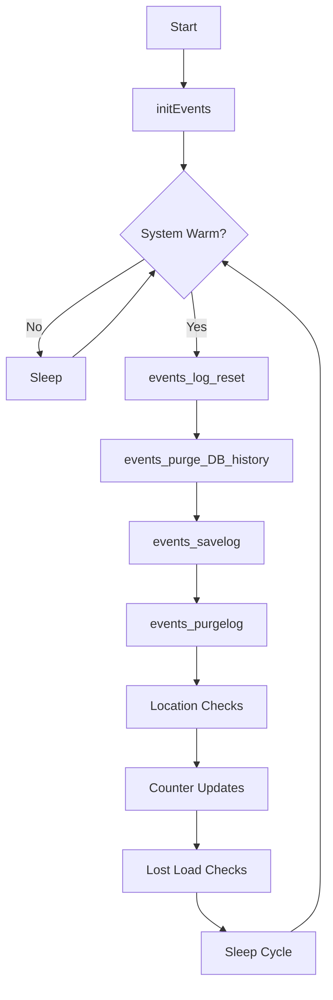

# p_ar_events (Events Handler)

**Document Version:** 1.0  
**Last Updated:** 2024-12-23  
**Author:** CmL  
**Source File:** `p_ar_events.cpp`  

---

## Overview

The Events Handler (`p_ar_events`) is a background process that manages periodic system events, data cleanup, integrity checks, and housekeeping tasks. It runs on a scheduled basis to maintain system health and data consistency.

---

## Purpose

- **Log Management:** Reset, save, and purge log files
- **Database Cleanup:** Purge historical records and maintain table sizes
- **Integrity Checks:** Verify location, load, and inventory consistency
- **Counter Maintenance:** Update and validate system counters
- **Time Registration:** Track system time events
- **Lost Load Detection:** Identify loads that haven't reached expected destinations

---

## Location

- **Source:** `D:\ICIS\AuroDev\clogan\AuroDev\MSVC Programs\area\p_ar_events\p_ar_events.cpp`
- **Executable:** `D:\Auro\Exec\p_ar_events.exe`
- **Lines of Code:** ~6,095

---

## Compile-Time Features

The events handler has configurable features enabled via `#define` directives:

| Feature | Define | Description |
|---------|--------|-------------|
| Out of System Loads | `CHECK_Out_System_Loads` | Deletes loads marked out of system |
| Location Checks | `CHECK_Locations` | Validates location/load consistency |
| Location Counters | `COUNT_Locations` | Updates location count statistics |
| Queued Checks V2 | `CHECK_QUEUED2` | Checks queued loads on bidirectional conveyors |
| Time Registration | `Do_Time_Registration` | Tracks system time events |
| ASRS Lost | `CHECK_ASRS_LOST` | Detects cases lost before ASRS infeed |

### Disabled Features (Available but not active)
- `CHECK_Enroutes` - Enroute counter verification
- `CHECK_Loads` - Load value validation
- `CHECK_For_Unknown_Loads` - Unknown load ELT errors
- `CHECK_Parts` - Part/inventory quantity checks
- `CHECK_E_MAIL` - Email server health
- `CHECK_Host` - Host log table cleanup
- `CHECK_Cold_Routes` - Cold route cleanup
- `CHECK_4_LOST` - Lost move deletion
- `CHECK_SHIPPING_JACKPOT` - Shipping output lane control
- `ELEM_2_MEMORY` - ELEM to mapped memory sync

---

## Process Flow



---

## Key Functions

### main()
```cpp
int main(long argc, char* argv[])
```
**Purpose:** Entry point and main event loop  
**Flow:**
1. Initialize process
2. Enter main loop on warm start
3. Execute scheduled events
4. Sleep between cycles

### initEvents()
```cpp
void initEvents(long argc, char* argv[])
```
**Purpose:** Initialize process and database connections  
**Operations:**
1. Common initialization
2. Database connection
3. Read system parameters
4. Initialize event counters

### events_log_reset()
```cpp
void events_log_reset()
```
**Purpose:** Reset log files at scheduled intervals  
**Operations:**
1. Check if reset time reached
2. Archive current logs
3. Create new log files
4. Update reset timestamp

### events_purge_DB_history()
```cpp
void events_purge_DB_history()
```
**Purpose:** Delete old records from history tables  
**Tables Purged:**
- `MHC_MOVS_LOG`
- `MHC_LOCN_LOG`
- `MHC_ERRHIST`
- `MHC_HOSTIN_LOG` (if enabled)
- `MHC_HOSTOUT_LOG` (if enabled)

### events_savelog()
```cpp
void events_savelog()
```
**Purpose:** Archive current log files  
**Operations:**
1. Copy log files to archive directory
2. Compress if configured
3. Update archive index

### events_purgelog()
```cpp
void events_purgelog()
```
**Purpose:** Delete old log archives  
**Operations:**
1. Scan archive directory
2. Delete files older than retention period
3. Remove empty directories

---

## Event Categories

### 1. Log Management Events

| Event | Frequency | Description |
|-------|-----------|-------------|
| Log Reset | Daily | Create new log files |
| Log Save | Hourly | Archive current logs |
| Log Purge | Daily | Remove old archives |

### 2. Database Maintenance Events

| Event | Frequency | Description |
|-------|-----------|-------------|
| History Purge | Daily | Delete old history records |
| Error History | Weekly | Archive error history |
| Move Log Cleanup | Daily | Purge old move logs |

### 3. Integrity Check Events

| Event | Frequency | Description |
|-------|-----------|-------------|
| Location Check | Per Cycle | Verify location/load consistency |
| Counter Sync | Per Cycle | Update location counters |
| Lost Load Check | Per Cycle | Detect lost loads |

---

## Dependencies

| Dependency | Type | Purpose |
|------------|------|---------|
| `cc_gg` | Library | Global variables |
| `cc_str` | Library | String operations |
| `cc_prc` | Library | Process control |
| `cc_sys` | Library | System status |
| `cc_plc` | Library | PLC interface |
| `cc_stk` | Library | Stacker interface |
| `cc_std` | Library | Stand interface |
| `cc_agv` | Library | AGV interface (if enabled) |
| `cs_elt` | Library | Element table |
| `cs_msg` | Library | Message queue |
| `cs_log` | Library | Logging |
| `cs_reg` | Library | Registry access |
| `ds_sql` | Library | Database interface |
| `ds_exec` | Library | SQL execution |

---

## Database Tables Accessed

| Table | Operation | Purpose |
|-------|-----------|---------|
| MHC_LOCN | SELECT, UPDATE | Location verification |
| MHC_LOAD | SELECT, UPDATE, DELETE | Load verification |
| MHC_INVT | SELECT, UPDATE, DELETE | Inventory verification |
| MHC_MOVS | SELECT, UPDATE, DELETE | Move verification |
| MHC_MOVS_LOG | DELETE | Move log purge |
| MHC_LOCN_LOG | DELETE | Location log purge |
| MHC_ERRHIST | DELETE | Error history purge |
| MHC_STTN | SELECT | Station status |
| MHC_LOCKS | SELECT, DELETE | Lock verification |
| MHC_LPROB | SELECT, INSERT | Load problems |

---

## Configuration Variables

| Variable | Type | Purpose |
|----------|------|---------|
| msLogDir | char[100] | Log file directory path |
| msArcDir | char[100] | Archive directory path |
| Need_More_of_These | char[21] | DB log purge indicator |
| gShortSleep | bool | Short sleep cycle flag |

---

## File Operations

### Log Directory Structure
```
D:\Auro\Log\
├── Current\              # Active log files
├── Archive\              # Archived logs by date
│   ├── 2024-12-23\
│   ├── 2024-12-22\
│   └── ...
└── Purged\               # Staging for deletion
```

### File Helper Functions

| Function | Purpose |
|----------|---------|
| `ICISGetFiles()` | Get list of files in directory |
| `eventDeleteFile()` | Delete a single file |
| `DelDir()` | Delete directory recursively |
| `eventDeleteDir()` | Delete empty directory |
| `convert_minutes()` | Convert time to string format |

---

## Location Integrity Checks

When `CHECK_Locations` is enabled:

```cpp
// Pseudo-code for location check
for each location:
    if location.status == FULL:
        verify load_exists(location.load_id)
        verify load.location == location.name
    if location.status == EMPTY:
        verify no_load_at_location(location.name)
    if mismatch:
        log_error()
        create_lprob_record()
        attempt_correction()
```

---

## Counter Maintenance

When `COUNT_Locations` is enabled:

| Counter | Description |
|---------|-------------|
| Total Empty | Count of empty locations |
| Total Full | Count of full locations |
| By Aisle | Counts per aisle |
| By Zone | Counts per storage zone |
| By Size | Counts per location size |

---

## Error Handling

| Error Condition | Handling | Action |
|-----------------|----------|--------|
| Database connection loss | Retry | Log and wait |
| File system error | Skip operation | Log error |
| Integrity mismatch | Create LPROB | Attempt correction |
| Counter mismatch | Recalculate | Update database |

---

## Related Documents

- [Process Index](00_Process_Index.md)
- [p_sy_erlog](p_sy_erlog.md) - Error Logging
- [p_sy_stats](p_sy_stats.md) - Statistics
- [ds_errors Module](../03_Shared_Libraries/04_DSUB/ds_errors.md)

---

## Cross-References

| Topic | Document | Section |
|-------|----------|---------|
| Location Table | [os_locn](../03_Shared_Libraries/01_OSUB/os_locn.md) | Schema |
| Error Logging | [cs_log_printf](../03_Shared_Libraries/03_CSUB/cs_log_printf.md) | Usage |
| Database Operations | [ds_sql](../03_Shared_Libraries/04_DSUB/ds_sql.md) | Interface |

---

## Changelog

| Version | Date | Changes |
|---------|------|---------|
| 1.0 | 2024-12-23 | Initial documentation |


