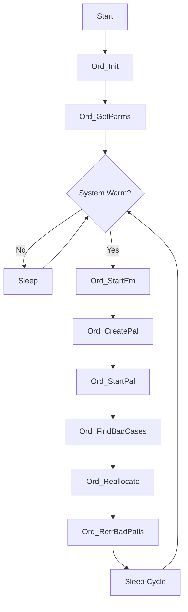
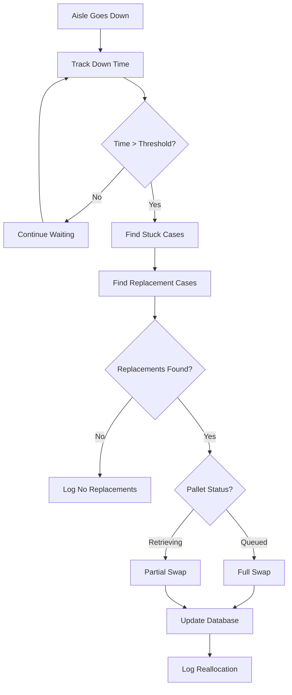

# p_ar_order (Order Processing)

**Document Version:** 1.0  
**Last Updated:** 2024-12-23  
**Author:** CmL  
**Source File:** `p_ar_order.cpp`  

---

## Overview

The Order Processing handler (`p_ar_order`) is a background process responsible for managing pallet orders, case allocation, retrieval scheduling, and reallocation when aisles are down. It coordinates the flow of cases from storage to palletization.

---

## Purpose

- **Order Management:** Start and manage queued orders
- **Pallet Creation:** Create pallet records and assign cases
- **Retrieval Scheduling:** Initiate case retrievals for active pallets
- **Bad Case Handling:** Identify and route bad/unknown cases
- **Reallocation:** Reallocate cases when aisles become unavailable
- **Orphan Management:** Handle orphaned and unknown pallets

---

## Location

- **Source:** `D:\ICIS\AuroDev\clogan\AuroDev\MSVC Programs\area\p_ar_order\p_ar_order.cpp`
- **Executable:** `D:\Auro\Exec\p_ar_order.exe`
- **Lines of Code:** ~3,331

---

## Process Flow



---

## Key Functions

### main()
```cpp
int main(int argc, char* argv[])
```
**Purpose:** Entry point and main processing loop  
**Flow:**
1. Initialize via `Ord_Init()`
2. Get parameters
3. Execute order processing functions in sequence
4. Sleep between cycles

### Ord_Init()
```cpp
void Ord_Init(int argc, char* argv[])
```
**Purpose:** Initialize process components  
**Operations:**
1. Common initialization
2. Database connection
3. Load accumulation stand information
4. Initialize tracking maps

### Ord_GetParms()
```cpp
void Ord_GetParms()
```
**Purpose:** Retrieve configuration from ELEM table  
**Parameters Retrieved:**
| Parameter | Variable | Description |
|-----------|----------|-------------|
| CasePerPallet4Hand | gCasesPerPallet4HandPallets | Cases per hand pallet |
| ReallocationTimeOut | gReallocationTimeOut | Aisle down timeout |
| PullOrphanedNow | gPullOrphanNow | Force orphan pull flag |
| PullUnknownsNow | gPullUnknNow | Force unknown pull flag |
| SchOrpPull | gSchOrhPull | Scheduled orphan pull time |
| SchUknPull | gSchUnkPull | Scheduled unknown pull time |
| AutoPullPallets | gDoAutoRetreival | Auto retrieval flag |

### Ord_StartEm()
```cpp
void Ord_StartEm()
```
**Purpose:** Find and start queued orders  
**Logic:**
1. Query for queued orders
2. Validate order requirements
3. Transition order status to active
4. Trigger pallet creation

### Ord_CreatePal()
```cpp
void Ord_CreatePal()
```
**Purpose:** Create pallet records for active orders  
**Operations:**
1. Get active orders needing pallets
2. Find available cases for each order
3. Create pallet records
4. Assign cases to pallets

### Ord_StartPal()
```cpp
void Ord_StartPal()
```
**Purpose:** Initiate retrieval for ready pallets  
**Validation Checks:**
1. Palletizer availability
2. Maximum concurrent retrievals
3. Downstream conveyor status
4. Aisle availability

### Ord_FindCases()
```cpp
std::vector<cc_comm_class::storedCase> Ord_FindCases(std::string orderID)
```
**Purpose:** Find all available cases for an order  
**Parameters:**
| Parameter | Type | Description |
|-----------|------|-------------|
| orderID | string | Order identifier |

**Returns:** Vector of available stored cases

### Ord_InsertPallet()
```cpp
long Ord_InsertPallet(std::string palletID, std::string orderID, 
                      std::string itemCode, std::string comment,
                      std::vector<cc_comm_class::storedCase> cases4Pallet, 
                      long palConfig)
```
**Purpose:** Create pallet database record  
**Parameters:**
| Parameter | Type | Description |
|-----------|------|-------------|
| palletID | string | Unique pallet identifier |
| orderID | string | Parent order ID |
| itemCode | string | Product item code |
| comment | string | Pallet comment |
| cases4Pallet | vector | Cases assigned to pallet |
| palConfig | long | Pallet configuration code |

### Ord_Reallocate()
```cpp
void Ord_Reallocate()
```
**Purpose:** Reallocate cases from downed aisles  
**Logic:**
1. Get list of downed aisles
2. Find cases stuck in each aisle
3. Find replacement cases in available aisles
4. Swap case assignments on pallets

### Ord_ReallocQueued() / Ord_ReallocRetriv()
```cpp
long Ord_ReallocQueued(std::string palletID, long aisle, 
                       std::vector<cc_comm_class::storedCase> myStuckCases,
                       std::vector<realPalLog>& logVec, bool& dbUpdate)

long Ord_ReallocRetriv(std::string palletID, long aisle,
                       std::vector<cc_comm_class::storedCase> myStuckCases,
                       std::vector<realPalLog>& logVec, bool& dbUpdate)
```
**Purpose:** Reallocate cases for queued or retrieving pallets  
**Difference:** Queued pallets can fully swap; retrieving pallets have restrictions

---

## Data Structures

### storedCaseData
```cpp
struct storedCaseData {
    std::string loadID;      // Load identifier
    std::string location;    // Storage location
};
```

### reallocCaseLoger
```cpp
struct reallocCaseLoger {
    storedCaseData stuckCase;        // Case being replaced
    storedCaseData replacementCase;  // Replacement case
};
```

### realPalLog
```cpp
struct realPalLog {
    std::string PalletID;                        // Pallet being modified
    std::vector<reallocCaseLoger> casesReallocated;  // Reallocation details
};
```

### PallStartFailures Enum
```cpp
enum PallStartFailures : long {
    RetrievingAlready    = 1,  // Too many pallets retrieving
    OrderStillQueued     = 2,  // Order not yet started
    DownStreamNOK        = 3,  // Conveyor path unavailable
    HasCasesStuckInAisle = 4,  // Cases in downed aisle
    OutfeedNOK           = 5   // Outfeed conveyor unavailable
};
```

---

## Dependencies

| Dependency | Type | Purpose |
|------------|------|---------|
| `cc_sys` | Library | System status |
| `cc_sim` | Library | Simulation support |
| `cc_plc` | Library | PLC communication |
| `cc_std` | Library | Stand control |
| `cc_stk` | Library | Stacker interface |
| `cc_str` | Library | String operations |
| `ds_sql` | Library | Database interface |
| `ds_key` | Library | Key lookups |
| `ds_create_pallet` | Library | Pallet creation |
| `ds_Realloc` | Library | Reallocation logic |

---

## Database Tables Accessed

| Table | Operation | Purpose |
|-------|-----------|---------|
| MHC_ORDR | SELECT, UPDATE | Order management |
| MHC_PALL | SELECT, INSERT, UPDATE | Pallet records |
| MHC_LOAD | SELECT, UPDATE | Load assignment |
| MHC_INVT | SELECT, UPDATE | Inventory status |
| MHC_MOVS | SELECT, INSERT, UPDATE | Move creation |
| MHC_HST_PROD | SELECT | Host product data |
| MHC_HSTIN | SELECT | Host inbound data |
| MHC_HSTOUT | INSERT | Host outbound messages |
| MHC_VLOAD_INVT | SELECT | Load/inventory view |
| MHC_VMOV_LOAD_INVT | SELECT | Move/load/inventory view |
| MHC_ELEM | SELECT, UPDATE | Configuration |
| MHC_LPROB | SELECT | Load problems |
| MHC_VDOWNASL | SELECT | Downed aisle view |

---

## Global Variables

| Variable | Type | Purpose |
|----------|------|---------|
| gSleepTime | long | Process sleep interval |
| gCasesPerPallet4HandPallets | long | Cases per hand pallet |
| gReallocationTimeOut | long | Reallocation timeout (seconds) |
| gMaxRetrieveAtTime | long | Max concurrent retrievals (default: 2) |
| gPullOrphanNow | bool | Force orphan pallet pull |
| gPullUnknNow | bool | Force unknown pallet pull |
| gDoAutoRetreival | bool | Enable auto retrieval |
| gSchOrhPull | char[7] | Scheduled orphan pull time |
| gSchUnkPull | char[7] | Scheduled unknown pull time |
| gLastOrhPull | double | Last orphan pull timestamp |
| gLastUnkPull | double | Last unknown pull timestamp |
| gDaAccStds | vector | Accumulation stands |
| gAisle2DownTime | map | Aisle down time tracking |

---

## Reallocation Logic



---

## Bad Case / Orphan Handling

### PALL_TYPE Enum
```cpp
enum PALL_TYPE {
    Unkn = 1,  // Unknown cases (no read)
    Orph = 2   // Orphaned cases (no pallet)
};
```

### Processing Logic
1. **Find Bad Cases:** Query for cases with problems
2. **Create Special Pallets:** Group bad cases into pallets
3. **Route to Hand Stack:** Send to manual processing area
4. **Schedule Retrieval:** Based on schedule or manual trigger

---

## Error Handling

| Error Condition | Handling | Action |
|-----------------|----------|--------|
| No cases available | Skip pallet creation | Log info |
| Palletizer offline | Delay retrieval | Check next cycle |
| Max retrievals reached | Queue pallet | Wait for completion |
| Reallocation failure | Keep original assignment | Log warning |
| Database error | Retry | Log if persistent |

---

## Related Documents

- [Process Index](00_Process_Index.md)
- [p_ar_arive](p_ar_arive.md) - Load Arrival
- [p_ar_release](p_ar_release.md) - Release Operations
- [ds_movs Module](../03_Shared_Libraries/04_DSUB/ds_movs.md)

---

## Cross-References

| Topic | Document | Section |
|-------|----------|---------|
| Pallet Table | [Database Reference](../../04_Database_Reference/) | MHC_PALL |
| Order Table | [Database Reference](../../04_Database_Reference/) | MHC_ORDR |
| Move Creation | [ds_movs](../03_Shared_Libraries/04_DSUB/ds_movs.md) | Create Move |

---

## Changelog

| Version | Date | Changes |
|---------|------|---------|
| 1.0 | 2024-12-23 | Initial documentation |


