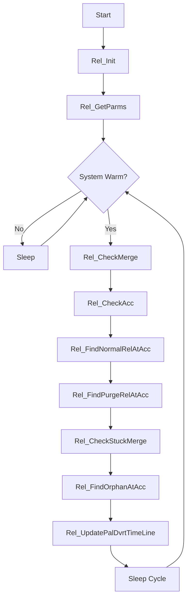

# p_ar_release (Release Operations)

**Document Version:** 1.0  
**Last Updated:** 2024-12-23  
**Author:** CmL  
**Source File:** `p_ar_release.cpp`  

---

## Overview

The Release Operations handler (`p_ar_release`) is a background process responsible for controlling the release of cases from accumulation lines and merge stations to downstream processes like palletization or hand stacking.

---

## Purpose

- **Merge Station Control:** Monitor and release cases from merge conveyors
- **Accumulation Line Release:** Control case flow from accumulation lines
- **Buffer Management:** Track and manage conveyor buffer positions
- **Purge Operations:** Handle pallet purging when cases are short
- **Orphan Detection:** Identify orphaned cases on accumulation lines
- **Load Present Verification:** Validate conveyor load present signals

---

## Location

- **Source:** `D:\ICIS\AuroDev\clogan\AuroDev\MSVC Programs\area\p_ar_release\p_ar_release.cpp`
- **Executable:** `D:\Auro\Exec\p_ar_release.exe`
- **Lines of Code:** ~3,552

---

## Process Flow



---

## Key Functions

### main()
```cpp
int main(int argc, char* argv[])
```
**Purpose:** Entry point and main processing loop  
**Flow:**
1. Initialize via `Rel_Init()`
2. Get configuration parameters
3. Execute release checks in sequence
4. Sleep between cycles

### Rel_Init()
```cpp
void Rel_Init(int argc, char* argv[])
```
**Purpose:** Initialize process components  
**Operations:**
1. Common initialization
2. Database connection
3. Build outfeed stand map
4. Initialize accumulation stand pointers

### Rel_CheckMerge()
```cpp
void Rel_CheckMerge()
```
**Purpose:** Check merge stations for release conditions  
**Operations:**
1. Get all moves for each merge station
2. Verify load present signals
3. Check if pallet is complete
4. Initiate release when ready

### Rel_AreOutFeedStdsOK()
```cpp
bool Rel_AreOutFeedStdsOK(int aisle, outStds myOutStds, relStruct& myRelStuc)
```
**Purpose:** Validate outfeed conveyor conditions  
**Parameters:**
| Parameter | Type | Description |
|-----------|------|-------------|
| aisle | int | Aisle number |
| myOutStds | outStds | Outfeed stand structure |
| myRelStuc | relStruct& | Release structure (output) |

**Returns:** `true` if outfeed is ready for release

### Rel_CheckAcc()
```cpp
void Rel_CheckAcc()
```
**Purpose:** Check accumulation lines for releases  
**Operations:**
1. Call `Rel_FindNormalRelAtAcc()` for standard releases
2. Call `Rel_FindPurgeRelAtAcc()` for purge releases

### Rel_RelMrgeStds()
```cpp
void Rel_RelMrgeStds(std::string palletID, std::map<int, relStruct> ailse2ReleaseMap)
```
**Purpose:** Release cases from merge stations  
**Parameters:**
| Parameter | Type | Description |
|-----------|------|-------------|
| palletID | string | Pallet identifier |
| ailse2ReleaseMap | map | Aisle to release info mapping |

### Rel_RelAcc()
```cpp
void Rel_RelAcc(std::string palletID, std::vector<std::string> casesReleasing, cc_stand* accLine)
```
**Purpose:** Release cases from an accumulation line  
**Parameters:**
| Parameter | Type | Description |
|-----------|------|-------------|
| palletID | string | Pallet identifier |
| casesReleasing | vector | Load IDs being released |
| accLine | cc_stand* | Accumulation line stand |

### Rel_PreMatureRelease()
```cpp
void Rel_PreMatureRelease(int aisleNumber, std::string palletID, int forceReleaseCnt = GP.BAD)
```
**Purpose:** Force premature release from merge station  
**Use Case:** Buffer full or stuck condition

### Rel_PurgePalletFromShort()
```cpp
void Rel_PurgePalletFromShort(std::string palletID, std::string mergeStdName, std::string reason)
```
**Purpose:** Purge a pallet due to missing cases  
**Operations:**
1. Mark pallet for purge
2. Update pallet status
3. Log reason for purge

---

## Data Structures

### relStruct
```cpp
struct relStruct {
    int                      caseCnt2Release;   // Cases to release
    std::string              palletID;          // Pallet identifier
    std::vector<std::string> cases2Release;     // Load IDs to release
};
```

### conveyorInfo
```cpp
struct conveyorInfo {
    cc_stand*       daStand;       // Stand pointer
    VMOV_LOAD_INVT  movLoadInvt;   // Move/load/inventory record
};
```

### outStds
```cpp
struct outStds {
    cc_stand* outStd;    // Stacker dropoff stand
    cc_stand* buff2Std;  // Buffer conveyor #2
    cc_stand* buff1Std;  // Buffer conveyor #1
    cc_stand* merge;     // Merge conveyor
};
```

### outConveyorInfo
```cpp
struct outConveyorInfo {
    conveyorInfo outStdInfo;    // Stacker dropoff
    conveyorInfo buff2StdInfo;  // Buffer #2
    conveyorInfo buff1StdInfo;  // Buffer #1
    conveyorInfo mergeInfo;     // Merge
};
```

### WRONG_REASON Enum
```cpp
enum WRONG_REASON {
    Unkn      = 1,  // Unknown reason
    TooLittle = 2,  // Too few cases
    TooMany   = 3   // Too many cases
};
```

### PalDvrSample
```cpp
struct PalDvrSample {
    double ts;      // Timestamp of check
    bool   online;  // Was station online?
};
```

---

## Dependencies

| Dependency | Type | Purpose |
|------------|------|---------|
| `cc_sys` | Library | System status |
| `cc_sim` | Library | Simulation |
| `cc_plc` | Library | PLC communication |
| `cc_std` | Library | Stand control |
| `cc_stk` | Library | Stacker interface |
| `cc_str` | Library | String operations |
| `cc_common` | Library | Common functions |
| `ds_sql` | Library | Database interface |
| `ds_key` | Library | Key lookups |
| `ds_create_pallet` | Library | Pallet operations |

---

## Database Tables Accessed

| Table | Operation | Purpose |
|-------|-----------|---------|
| MHC_MOVS | SELECT, UPDATE | Move tracking |
| MHC_LOAD | SELECT, UPDATE | Load status |
| MHC_INVT | SELECT, UPDATE | Inventory status |
| MHC_PALL | SELECT, UPDATE | Pallet status |
| MHC_VMOV_LOAD_INVT | SELECT | Combined view |
| MHC_ELEM | SELECT | Configuration |
| MHC_LPROB | SELECT, INSERT | Load problems |

---

## Global Variables

| Variable | Type | Purpose |
|----------|------|---------|
| gSleepTime | long | Process sleep interval |
| gDvrtTimeout | long | Divert timeout (minutes) |
| gStopReleaseFromMerge | bool | Stop merge releases |
| gStopReleaseFromAcc | bool | Stop accumulation releases |
| gAisle2OutStds | map | Aisle to outfeed mapping |
| gPalDvrt | cc_stand* | Pallet divert station |
| gMySend2PalStands | vector | Send-to-pallet stands |
| gMyAccStands | vector | Accumulation stand names |

---

## Conveyor Flow Diagram

```
ASRS Storage
     │
     ▼
┌─────────────┐
│ Stacker     │
│ Dropoff     │  (outStd)
└─────────────┘
     │
     ▼
┌─────────────┐
│ Buffer #2   │  (buff2Std)
└─────────────┘
     │
     ▼
┌─────────────┐
│ Buffer #1   │  (buff1Std)
└─────────────┘
     │
     ▼
┌─────────────┐
│ Merge       │  (merge)
│ Station     │
└─────────────┘
     │
     ▼
┌─────────────┐
│ Accumulation│
│ Line        │
└─────────────┘
     │
     ▼
┌─────────────┐
│ Palletizer/ │
│ Hand Stack  │
└─────────────┘
```

---

## Release Logic

### Normal Release Flow
1. Check if pallet is complete (all cases present)
2. Verify downstream is available
3. Verify no other pallet is releasing
4. Set release bit in PLC
5. Track cases as they release

### Purge Release Flow
1. Detect pallet is flagged for purge
2. Release available cases regardless of completion
3. Mark pallet as purged
4. Log purge reason

### Orphan Handling
1. Detect cases on accumulation without active pallet
2. Create orphan pallet record
3. Route to hand stack area

---

## Pallet Divert Timeline

The `gPalDvrtTimeLine` object tracks the online/offline status of the pallet divert station to properly calculate lost case timeouts:

```cpp
// Only count time when divert station was online
for (each sample in timeline) {
    if (sample.online) {
        cumulativeTime += elapsed_since_last_sample;
    }
}
if (cumulativeTime > timeout) {
    mark_case_as_lost();
}
```

---

## Error Handling

| Error Condition | Handling | Action |
|-----------------|----------|--------|
| Conveyor offline | Skip release | Wait for online |
| Missing cases | Purge pallet | Route to hand stack |
| Buffer full | Premature release | Force release |
| Timeout | Create LPROB | Flag case as lost |

---

## Related Documents

- [Process Index](00_Process_Index.md)
- [p_ar_arive](p_ar_arive.md) - Load Arrival
- [p_ar_order](p_ar_order.md) - Order Processing
- [cc_std Module](../03_Shared_Libraries/02_CCSUB/cc_std.md)

---

## Cross-References

| Topic | Document | Section |
|-------|----------|---------|
| Stand Control | [cc_std](../03_Shared_Libraries/02_CCSUB/cc_std.md) | Release Operations |
| PLC Control | [cc_plc](../03_Shared_Libraries/02_CCSUB/cc_plc.md) | Bit Control |
| Move Tracking | [ds_movs](../03_Shared_Libraries/04_DSUB/ds_movs.md) | Status Updates |

---

## Changelog

| Version | Date | Changes |
|---------|------|---------|
| 1.0 | 2024-12-23 | Initial documentation |


