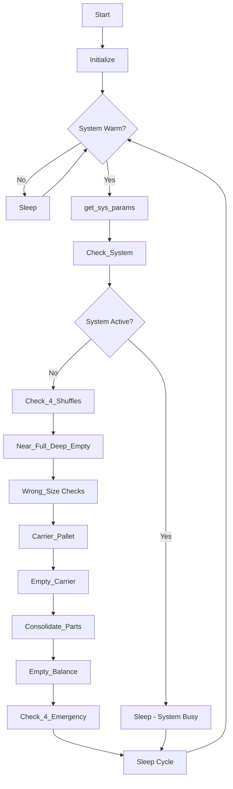

# p_ar_shuffle (Shuffle Operations)

**Document Version:** 1.0  
**Last Updated:** 2024-12-23  
**Author:** CmL  
**Source File:** `p_ar_shuffle.cpp`  

---

## Overview

The Shuffle Operations handler (`p_ar_shuffle`) is a background process responsible for optimizing load positions within the rack during idle periods. It performs various shuffle operations to improve system efficiency and storage density.

---

## Purpose

- **Near/Deep Optimization:** Move loads to deep positions when near position has load but deep is empty
- **Size Optimization:** Relocate loads stored in wrong-size locations
- **Carrier Consolidation:** Combine empty carriers to free locations
- **Part Consolidation:** Group partial pallets of same part/expiration
- **Zone Balancing:** Balance empty carriers across storage zones
- **Emergency Handling:** Handle full rack emergency situations

---

## Location

- **Source:** `D:\ICIS\AuroDev\clogan\AuroDev\MSVC Programs\area\p_ar_shuffle\p_ar_shuffle.cpp`
- **Executable:** `D:\Auro\Exec\p_ar_shuffle.exe`
- **Lines of Code:** ~2,392

---

## Process Flow



---

## Key Functions

### main()
```cpp
int main(long argc, char* argv[])
```
**Purpose:** Entry point and main processing loop  
**Flow:**
1. Initialize process
2. Check if system is idle
3. Execute shuffle operations
4. Sleep between cycles

### Check_System()
```cpp
bool Check_System()
```
**Purpose:** Determine if system is idle enough for shuffles  
**Returns:** `true` if system is active (skip shuffles), `false` if idle

### Check_Stands()
```cpp
long Check_Stands()
```
**Purpose:** Check I/O stand activity  
**Returns:** Count of active stands

### Check_4_Moves()
```cpp
long Check_4_Moves()
```
**Purpose:** Check for pending/active moves  
**Returns:** Count of moves in progress

### Check_4_Shuffles()
```cpp
void Check_4_Shuffles()
```
**Purpose:** Main shuffle logic dispatcher  
**Operations:**
1. Call each shuffle function by priority
2. Wake dispatcher if shuffles created
3. Track shuffle statistics

### Near_Full_Deep_Empty()
```cpp
long Near_Full_Deep_Empty(long aisle)
```
**Purpose:** Find loads in near position where deep is empty  
**Parameters:**
| Parameter | Type | Description |
|-----------|------|-------------|
| aisle | long | Aisle to check |

**Returns:** Count of shuffles created

### Wrong_Size_Near_Empty_Deep_Full()
```cpp
long Wrong_Size_Near_Empty_Deep_Full(long aisle)
```
**Purpose:** Find loads in wrong-size locations where better fit exists  
**Returns:** Count of shuffles created

### Wrong_Size_Near_Full_Deep_FULL()
```cpp
long Wrong_Size_Near_Full_Deep_FULL(long aisle)
```
**Purpose:** Handle double-deep wrong-size situations  
**Returns:** Count of shuffles created

### Shuffle_Me()
```cpp
long Shuffle_Me(char* loadid, char* from_location, char* to_location, 
                char* module, long line, char* comment, long shuffle_flag = 1)
```
**Purpose:** Create a shuffle move record  
**Parameters:**
| Parameter | Type | Description |
|-----------|------|-------------|
| loadid | char* | Load to shuffle |
| from_location | char* | Source location |
| to_location | char* | Destination location |
| module | char* | Calling module name |
| line | long | Source line number |
| comment | char* | Shuffle reason |
| shuffle_flag | long | Shuffle type flag (default: 1) |

### Store_Me()
```cpp
long Store_Me(char* loadid, char* module, long line, char* comment)
```
**Purpose:** Create a re-store move for a load  
**Use Case:** When load needs to move but destination TBD

### Carrier_Pallet()
```cpp
long Carrier_Pallet(long aisle)
```
**Purpose:** Check if empty carrier is stored with full pallet  
**Goal:** Separate carriers from product pallets

### Empty_Carrier()
```cpp
long Empty_Carrier(long aisle)
```
**Purpose:** Consolidate empty carriers  
**Goal:** Stack carriers to free locations

### Consolidate_Parts()
```cpp
long Consolidate_Parts(long aisle)
```
**Purpose:** Consolidate pallets with same part/expiration  
**Goal:** Reduce partial pallets

### Consolidate_Single_Parts()
```cpp
long Consolidate_Single_Parts(long aisle)
```
**Purpose:** Handle single-case pallets  
**Goal:** Combine singles into fuller pallets

### Empty_Balance()
```cpp
long Empty_Balance(long aisle)
```
**Purpose:** Balance empty carriers across zones  
**Goal:** Ensure each zone has required empties

### Empty_Limit_Percent()
```cpp
long Empty_Limit_Percent(long* empty_reserve)
```
**Purpose:** Calculate empty carrier limit by percentage  
**Returns:** Calculated limit

### Get_Zone_Count()
```cpp
long Get_Zone_Count(long aisle, char* location)
```
**Purpose:** Get empty location count in a zone  
**Returns:** Count of empties in zone

### Check_4_Emergency()
```cpp
void Check_4_Emergency()
```
**Purpose:** Check for and handle full rack emergency  
**Operations:**
1. Detect if rack is nearly full
2. Trigger emergency protocols
3. Alert operators

---

## Shuffle Types

### 1. Near/Deep Optimization
```
Before:                After:
┌────┬────┐           ┌────┬────┐
│LOAD│    │    →      │    │LOAD│
│Near│Deep│           │Near│Deep│
└────┴────┘           └────┴────┘
```
**Benefit:** Frees near position for easier access

### 2. Size Optimization
```
Before (Size 2 in Size 3 slot):    After:
┌─────────────┐                    ┌─────────┐
│   LOAD      │      →             │  LOAD   │
│  (Size 2)   │                    │(Size 2) │
└─────────────┘                    └─────────┘
  Size 3 slot                       Size 2 slot
```
**Benefit:** Frees larger slot for larger loads

### 3. Carrier Consolidation
```
Before:                After:
┌────┐ ┌────┐         ┌────────┐
│ EC │ │ EC │   →     │EC ║ EC │
└────┘ └────┘         └────────┘
2 locations           1 location (stacked)
```
**Benefit:** Frees storage locations

### 4. Part Consolidation
```
Before:                After:
┌────┐ ┌────┐         ┌────────┐
│5 ea│ │3 ea│   →     │  8 ea  │
│PartA│PartA│         │ PartA  │
└────┘ └────┘         └────────┘
```
**Benefit:** Reduces partial pallets

---

## Dependencies

| Dependency | Type | Purpose |
|------------|------|---------|
| `cc_gg` | Library | Global variables |
| `cc_str` | Library | String operations |
| `cc_prc` | Library | Process control |
| `cc_stk` | Library | Stacker interface |
| `cc_std` | Library | Stand interface |
| `cc_sys` | Library | System status |
| `cs_elt` | Library | Element table |
| `cs_tim` | Library | Timer functions |
| `cs_msg` | Library | Message queue |
| `cs_log` | Library | Logging |
| `ds_sql` | Library | Database interface |

---

## Database Tables Accessed

| Table | Operation | Purpose |
|-------|-----------|---------|
| MHC_LOCN | SELECT | Location information |
| MHC_LOAD | SELECT | Load information |
| MHC_INVT | SELECT | Inventory information |
| MHC_MOVS | SELECT, INSERT | Move creation |
| MHC_MOVS_LOG | INSERT | Move history |
| MHC_PART | SELECT | Part information |
| MHC_CONPART | SELECT | Container/part mapping |
| MHC_VFINDR | SELECT | Location finder view |
| MHC_VLOSEL | SELECT | Location selection view |
| MHC_VLOCN_LOAD | SELECT | Location/load view |

---

## Configuration Parameters

| Variable | Type | Purpose |
|----------|------|---------|
| Sleep_Time | long | Process sleep interval |
| start_SR | long | Starting stacker index |
| end_SR | long | Ending stacker index |
| Reset_Shuffle_Flag | bool | Reset shuffle prevention flag |

From ELEM table:
| Parameter | Description |
|-----------|-------------|
| (Site-specific) | Shuffle priorities and limits |

---

## Global Variables

| Variable | Type | Purpose |
|----------|------|---------|
| Wake_MOVDP | bool | Signal to wake move dispatcher |
| Wake_FNDWK | bool | Signal to wake find work |
| start_SR_idx | long | Last stacker checked |
| current_SR_idx | long | Current stacker being checked |
| Last_Shuffle_Message | char[256] | Last shuffle status |
| Count_of_Loaded_Work | long | Empty carriers at workstations |

---

## Shuffle Priority Order

1. **Near Full / Deep Empty** - Most beneficial for access
2. **Wrong Size - Near Empty** - Optimize size utilization
3. **Wrong Size - Both Full** - Complex optimization
4. **Carrier with Pallet** - Separate empties from product
5. **Empty Carrier Consolidation** - Stack carriers
6. **Part Consolidation** - Reduce partials
7. **Single Part Consolidation** - Handle singles
8. **Empty Balance** - Zone balancing
9. **Emergency Handling** - Full rack situations

---

## Activity Check Logic

Shuffles only run when system is idle:

```cpp
if (Check_System() == true) {
    // System active - skip shuffles
    Sleep(Sleep_Time);
    continue;
}
// System idle - proceed with shuffles
Check_4_Shuffles();
```

**Idle Criteria:**
- No pending moves
- No active I/O at stands
- No stackers actively working
- System warm and online

---

## Error Handling

| Error Condition | Handling | Action |
|-----------------|----------|--------|
| No suitable destination | Skip load | Try next load |
| Database error | Retry | Log if persistent |
| Stacker busy | Skip aisle | Try next cycle |
| Location locked | Skip location | Try next |

---

## Related Documents

- [Process Index](00_Process_Index.md)
- [p_ar_stkdp](p_ar_stkdp.md) - Stacker Dispatcher
- [p_ar_movdp](p_ar_movdp.md) - Move Dispatcher
- [ds_get_locn Module](../03_Shared_Libraries/04_DSUB/ds_get_locn.md)

---

## Cross-References

| Topic | Document | Section |
|-------|----------|---------|
| Location Selection | [ds_get_locn](../03_Shared_Libraries/04_DSUB/ds_get_locn.md) | Store Location |
| Move Creation | [ds_movs](../03_Shared_Libraries/04_DSUB/ds_movs.md) | Create Move |
| Stacker Operations | [cc_stk](../03_Shared_Libraries/02_CCSUB/cc_stk.md) | Work Assignment |

---

## Changelog

| Version | Date | Changes |
|---------|------|---------|
| 1.0 | 2024-12-23 | Initial documentation |


