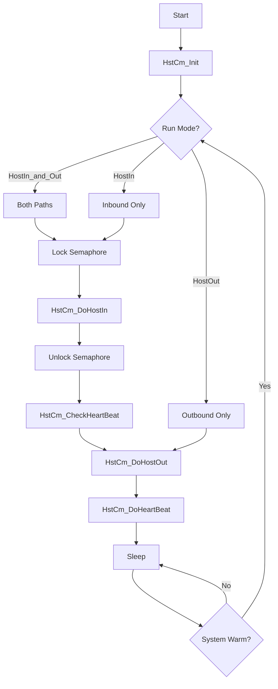
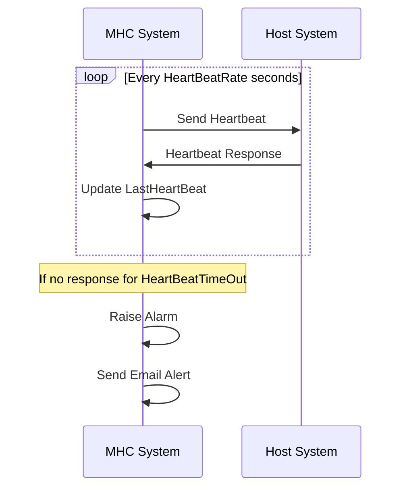

# p_cc_hostcom (Host Communications)

**Document Version:** 1.0  
**Last Updated:** 2024-12-23  
**Author:** CmL  
**Source File:** `p_cc_hostcom.cpp`  

---

## Overview

The Host Communications handler (`p_cc_hostcom`) is a background process responsible for managing bidirectional communication with external host systems (WMS, ERP, etc.). It processes incoming messages from the host and sends outgoing status/completion messages.

---

## Purpose

- **Host Inbound Processing:** Receive and process orders, priority changes, and heartbeats
- **Host Outbound Processing:** Send status updates, completions, and heartbeats
- **Heartbeat Management:** Monitor host connectivity via heartbeat mechanism
- **Order Management:** Process order requests from host system
- **Priority Changes:** Handle real-time priority updates
- **Email Notifications:** Send alerts for communication failures

---

## Location

- **Source:** `D:\ICIS\AuroDev\clogan\AuroDev\MSVC Programs\area\p_cc_hostcom\p_cc_hostcom.cpp`
- **Executable:** `D:\Auro\Exec\p_cc_hostcom.exe`
- **Lines of Code:** ~1,551

---

## Run Modes

The process supports multiple run modes configured at startup:

| Mode | Value | Description |
|------|-------|-------------|
| `NotSet` | 0 | Configuration not set |
| `HostIn_and_Out` | 1 | Both inbound and outbound |
| `HostIn` | 2 | Inbound only |
| `HostOut` | 3 | Outbound only |

---

## Process Flow



---

## Key Functions

### main()
```cpp
int main(int argc, char* argv[])
```
**Purpose:** Entry point and main processing loop  
**Flow:**
1. Initialize via `HstCm_Init()`
2. Determine run mode from command line
3. Process inbound/outbound based on mode
4. Handle heartbeat monitoring
5. Sleep between cycles

### HstCm_Init()
```cpp
void HstCm_Init(int argc, char* argv[])
```
**Purpose:** Initialize process components  
**Operations:**
1. Common initialization
2. Database connection
3. Determine run mode from arguments
4. Initialize message queue

### HstCm_GetParms()
```cpp
void HstCm_GetParms()
```
**Purpose:** Retrieve configuration from ELEM table  
**Parameters Retrieved:**
| Parameter | Variable | Description |
|-----------|----------|-------------|
| AllowPartialRequ | gAllowPartialPallets | Allow partial pallet orders |
| UseHeartBeat | gUseHeartBeat | Enable heartbeat |
| HeartBeatRate | gHeartBeatRate | Heartbeat interval |
| HeartBeatTimeOut | gHeartBeatTimeOut | Timeout threshold |
| LastHeartBeatDTM | gLastHeartBeat | Last heartbeat timestamp |

### HstCm_DoHostIn()
```cpp
void HstCm_DoHostIn()
```
**Purpose:** Process inbound messages from host  
**Operations:**
1. Check for pending HSTIN records
2. Process each message by type
3. Update record status
4. Send response/acknowledgment

### HstCm_ChkHstIn()
```cpp
bool HstCm_ChkHstIn()
```
**Purpose:** Check if inbound messages exist  
**Returns:** `true` if messages pending

### HstCm_ProcOrdReq()
```cpp
long HstCm_ProcOrdReq(HSTIN myHostIn, long& requestResult, std::string& resultStr)
```
**Purpose:** Process an order request from host  
**Parameters:**
| Parameter | Type | Direction | Description |
|-----------|------|-----------|-------------|
| myHostIn | HSTIN | In | Inbound message record |
| requestResult | long& | Out | Result code |
| resultStr | string& | Out | Result description |

**Returns:** GP.GOOD on success, GP.BAD on failure

### HstCm_ProcProChg()
```cpp
long HstCm_ProcProChg(HSTIN myHostIn, long& requestResult, std::string& resultStr)
```
**Purpose:** Process priority change request  
**Operations:**
1. Validate order exists
2. Update priority in database
3. Re-sequence if needed

### HstCm_ProcHeartBeat()
```cpp
long HstCm_ProcHeartBeat(HSTIN myHostIn, std::string& resultStr)
```
**Purpose:** Process heartbeat from host  
**Operations:**
1. Update last heartbeat timestamp
2. Clear any heartbeat alarms
3. Log heartbeat receipt

### HstCm_DoHostOut()
```cpp
void HstCm_DoHostOut()
```
**Purpose:** Process outbound messages to host  
**Operations:**
1. Query for pending HSTOUT records
2. Format message for host
3. Send via configured protocol
4. Update record status

### HstCm_DoHeartBeat()
```cpp
void HstCm_DoHeartBeat()
```
**Purpose:** Send heartbeat to host  
**Operations:**
1. Check if interval elapsed
2. Create heartbeat record
3. Send to host
4. Update sent timestamp

### HstCm_CheckHeartBeat()
```cpp
void HstCm_CheckHeartBeat()
```
**Purpose:** Check for heartbeat timeout  
**Operations:**
1. Calculate time since last heartbeat
2. Compare against timeout threshold
3. Raise alarm if exceeded
4. Send email notification if configured

---

## Message Types

### Inbound (Host to MHC)

| Type | Description | Handler |
|------|-------------|---------|
| Order Request | New pallet order | `HstCm_ProcOrdReq()` |
| Priority Change | Update order priority | `HstCm_ProcProChg()` |
| Heartbeat | Connectivity check | `HstCm_ProcHeartBeat()` |

### Outbound (MHC to Host)

| Type | Description |
|------|-------------|
| Order Acknowledgment | Confirm order received |
| Pallet Complete | Pallet ready for pickup |
| Pallet Released | Pallet released to conveyor |
| Heartbeat | Connectivity check |
| Status Update | System status changes |

---

## Dependencies

| Dependency | Type | Purpose |
|------------|------|---------|
| `cc_sys` | Library | System status |
| `cc_sim` | Library | Simulation support |
| `cc_plc` | Library | PLC interface |
| `cc_std` | Library | Stand control |
| `cc_stk` | Library | Stacker interface |
| `cc_str` | Library | String operations |
| `cc_common` | Library | Common functions |
| `ds_sql` | Library | Database interface |
| `ds_key` | Library | Key lookups |
| `ds_create_pallet` | Library | Pallet operations |
| `ds_EmailHelp` | Library | Email notifications |
| `cs_sem` | Library | Semaphore control |

---

## Database Tables Accessed

| Table | Operation | Purpose |
|-------|-----------|---------|
| MHC_HSTIN | SELECT, UPDATE | Inbound messages |
| MHC_HSTOUT | SELECT, INSERT, UPDATE | Outbound messages |
| MHC_ORDR | SELECT, INSERT, UPDATE | Order management |
| MHC_PALL | SELECT, UPDATE | Pallet status |
| MHC_LOAD | SELECT | Load information |
| MHC_INVT | SELECT | Inventory information |
| MHC_VLOAD_INVT | SELECT | Load/inventory view |
| MHC_VAVL_CASE | SELECT | Available cases view |
| MHC_HST_PROD | SELECT | Host product data |
| MHC_ELEM | SELECT, UPDATE | Configuration |

---

## Semaphore Usage

The process uses semaphores to coordinate with other pallet-modifying processes:

```cpp
// Lock before modifying pallets
cs_sem_lock(GP.prgnam.SEM_NAMES.Pallet_Changers(), 0);

// Process host inbound (may modify pallets)
HstCm_DoHostIn();

// Unlock after completion
cs_sem_unlock(GP.prgnam.SEM_NAMES.Pallet_Changers());
```

**Purpose:** Prevent race conditions when multiple processes modify pallet records

---

## Global Variables

| Variable | Type | Purpose |
|----------|------|---------|
| gQueName | char[20] | Message queue name |
| gSleepTime | long | Process sleep interval |
| gHeartBeatTimeOut | long | Heartbeat timeout (seconds) |
| gHeartBeatRate | long | Heartbeat send rate |
| gSentHeartBeat | double | Last sent heartbeat timestamp |
| gLastHeartBeat | double | Last received heartbeat |
| gMyRunType | RunType | Current run mode |
| gAllowPartialPallets | bool | Allow partial orders |
| gUseHeartBeat | bool | Heartbeat enabled |

---

## Heartbeat Logic



---

## Error Handling

| Error Condition | Handling | Action |
|-----------------|----------|--------|
| Invalid order | Reject with error code | Log and notify |
| Heartbeat timeout | Raise alarm | Email notification |
| Database error | Retry | Log if persistent |
| Invalid message format | Reject message | Log details |
| Duplicate order | Reject with error | Return existing ID |

---

## Email Notifications

When `ds_EmailHelp` is configured, the process can send emails for:
- Heartbeat timeout
- Critical errors
- Communication failures

---

## Related Documents

- [Process Index](00_Process_Index.md)
- [p_ar_order](p_ar_order.md) - Order Processing
- [p_si_AuroHost](p_si_AuroHost.md) - Auro Host Integration
- [cs_sem Module](../03_Shared_Libraries/03_CSUB/cs_sem.md)

---

## Cross-References

| Topic | Document | Section |
|-------|----------|---------|
| Semaphores | [cs_sem](../03_Shared_Libraries/03_CSUB/cs_sem.md) | Lock/Unlock |
| Order Processing | [p_ar_order](p_ar_order.md) | Order Flow |
| Database Operations | [ds_sql](../03_Shared_Libraries/04_DSUB/ds_sql.md) | Interface |

---

## Changelog

| Version | Date | Changes |
|---------|------|---------|
| 1.0 | 2024-12-23 | Initial documentation |


