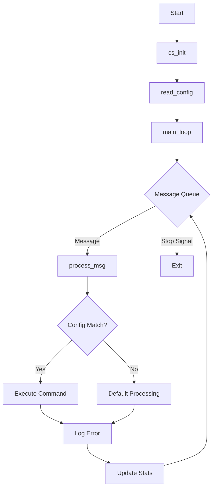
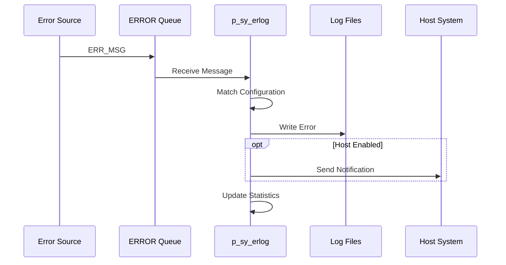

# p_sy_erlog (Error Logger)

**Document Version:** 1.0  
**Last Updated:** 2024-12-23  
**Author:** CmL  
**Source File:** `p_sy_erlog.cpp`  

---

## Overview

The Error Logger (`p_sy_erlog`) is a background process that provides centralized error message processing. It receives errors from the ERROR message queue and processes them according to configured rules, supporting logging, actions, and host notifications.

---

## Purpose

- **Centralized Error Handling:** Process all system error messages in one place
- **Configurable Actions:** Execute configured actions based on error type/level
- **Error Logging:** Write errors to log files
- **Host Notification:** Forward errors to host system when configured
- **Error Statistics:** Track error counts in mapped memory
- **History Tracking:** Maintain error dialog history

---

## Location

- **Source:** `D:\ICIS\AuroDev\clogan\AuroDev\Base\trunk\MSVC Programs\sysc\p_sy_erlog\p_sy_erlog.cpp`
- **Executable:** `D:\Auro\Exec\p_sy_erlog.exe`
- **Lines of Code:** ~878

---

## Process Flow



---

## Key Functions

### main()
```cpp
long main(long argc, char* argv[])
```
**Purpose:** Entry point and initialization  
**Flow:**
1. Initialize via `cs_init()`
2. Get log file names from message file
3. Read configuration
4. Enter main loop

### main_loop()
```cpp
void main_loop(void)
```
**Purpose:** Main message processing loop  
**Operations:**
1. Wait for message on ERROR queue
2. Process each message via `process_msg()`
3. Periodically check dialog history
4. Handle stop signal

### read_config()
```cpp
long read_config(void)
```
**Purpose:** Read error processing configuration  
**Configuration Types:**
- Level defaults
- Level-specific rules
- Error-specific rules

### process_msg()
```cpp
void process_msg(ERR_MSG* msg)
```
**Purpose:** Process a single error message  
**Parameters:**
| Parameter | Type | Description |
|-----------|------|-------------|
| msg | ERR_MSG* | Error message structure |

**Operations:**
1. Match message to configuration
2. Execute configured commands
3. Log to appropriate destination

### prt_error()
```cpp
void prt_error(char* errmsg, char* logdev, long commnd)
```
**Purpose:** Print/log an error message  
**Parameters:**
| Parameter | Type | Description |
|-----------|------|-------------|
| errmsg | char* | Formatted error message |
| logdev | char* | Log device/file |
| commnd | long | Command flags |

### std_error()
```cpp
void std_error(char* errmsg, long errmsg_size, long commnd)
```
**Purpose:** Write error to standard error output

### log_error()
```cpp
void log_error(char* errmsg, long errmsg_size, char* logdev, long commnd)
```
**Purpose:** Write error to log file

### chk_dialg_hist()
```cpp
void chk_dialg_hist(void)
```
**Purpose:** Check and maintain dialog history  
**Operations:**
1. Check history age
2. Archive old entries
3. Maintain history size limits

---

## Configuration System

### Configuration Types
```cpp
enum cfg_types {
    CFG_LEVDEF,    // Level default settings
    CFG_LEVEL,     // Level-specific rules
    CFG_ERROR,     // Error-specific rules
    CFG_MAX
};
```

### Commands
```cpp
enum cfg_commands {
    CMD_ERROR,     // Log as error
    CMD_LOG,       // Log to file
    CMD_ACT,       // Perform action
    CMD_HOST,      // Send to host
    CMD_MAX
};
```

### ERR_CONFIG Structure
```cpp
typedef struct err_config {
    struct err_config* next;    // Linked list pointer
    long        type;           // Configuration type
    long        key;            // Level number or error code
    GP_BOOL     set;            // TRUE=set, FALSE=clear
    long        sequence;       // Command sequence
    long        cmd;            // Command to execute
    char        parms[MAX_PARMS][IL_ERRPRM_ONE]; // Parameters
} ERR_CONFIG;
```

### Timing Constants
```cpp
#define TIM_EVERY   -1    // Execute on every occurrence
#define TIM_ONCE    -2    // Execute only once
```

---

## Error Message Structure

The process receives `ERR_MSG` structures from the ERROR queue:

```cpp
typedef struct {
    long        error_code;     // Error number
    long        error_level;    // Severity level
    char        source[...];    // Error source
    char        message[...];   // Error text
    // ... additional fields
} ERR_MSG;
```

---

## Log Files

| Log File | Purpose |
|----------|---------|
| `g_log_erlog` | This process's log |
| `g_log_error` | Main error log |
| `g_log_history` | Error history log |
| `g_mem_error` | Mapped memory error stats |

---

## Dependencies

| Dependency | Type | Purpose |
|------------|------|---------|
| `cc_gg` | Library | Global variables |
| `cc_prc` | Library | Process control |
| `cc_str` | Library | String operations |
| `cc_sys` | Library | System status |
| `cc_mem` | Library | Mapped memory |
| `cs_txt` | Library | Text messages |
| `cs_msg` | Library | Message queue |
| `cs_err` | Library | Error utilities |
| `cs_log` | Library | Logging |
| `cs_elt` | Library | Element tracking |
| `cs_dtm` | Library | Date/time |

---

## Message Queue

| Queue | Direction | Purpose |
|-------|-----------|---------|
| ERROR | Input | Receive error messages |

---

## Global Variables

| Variable | Type | Purpose |
|----------|------|---------|
| g_log_erlog | char[] | This process's log name |
| g_log_error | char[] | Main error log name |
| g_log_history | char[] | History log name |
| g_mem_error | char[] | Error stats memory name |
| g_cfg_list | ERR_CONFIG* | Configuration list head |
| g_ctl | ERR_CTL* | Error control structure |

---

## Configuration Matching

Configuration rules are matched in this order:
1. **Error-specific:** Exact error code match
2. **Level-specific:** Error level match
3. **Level default:** Default for level

```cpp
// Pseudocode for configuration matching
for each config in g_cfg_list:
    if config.type == CFG_ERROR && config.key == msg.error_code:
        execute(config)
        break
    else if config.type == CFG_LEVEL && config.key == msg.error_level:
        execute(config)
        break
    else if config.type == CFG_LEVDEF && msg.error_level matches:
        execute(config)
        break
```

---

## Error Processing Flow



---

## Error Handling

| Error Condition | Handling | Action |
|-----------------|----------|--------|
| Config file error | Use defaults | Log warning |
| Queue error | Retry | Log if persistent |
| Log file error | Skip logging | Continue processing |
| Host send failure | Retry | Queue for later |

---

## Related Documents

- [Process Index](00_Process_Index.md)
- [p_sy_errdev](p_sy_errdev.md) - Error Device Monitor
- [cs_err Module](../03_Shared_Libraries/03_CSUB/cs_err.md)
- [cs_msg Module](../03_Shared_Libraries/03_CSUB/cs_msg.md)

---

## Cross-References

| Topic | Document | Section |
|-------|----------|---------|
| Error Utilities | [cs_err](../03_Shared_Libraries/03_CSUB/cs_err.md) | Functions |
| Message Queues | [cs_msg](../03_Shared_Libraries/03_CSUB/cs_msg.md) | Queue Operations |
| Logging | [cs_log_printf](../03_Shared_Libraries/03_CSUB/cs_log_printf.md) | Usage |

---

## Changelog

| Version | Date | Changes |
|---------|------|---------|
| 1.0 | 2024-12-23 | Initial documentation |


