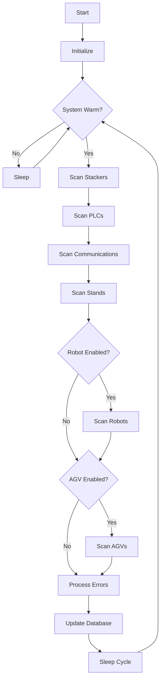
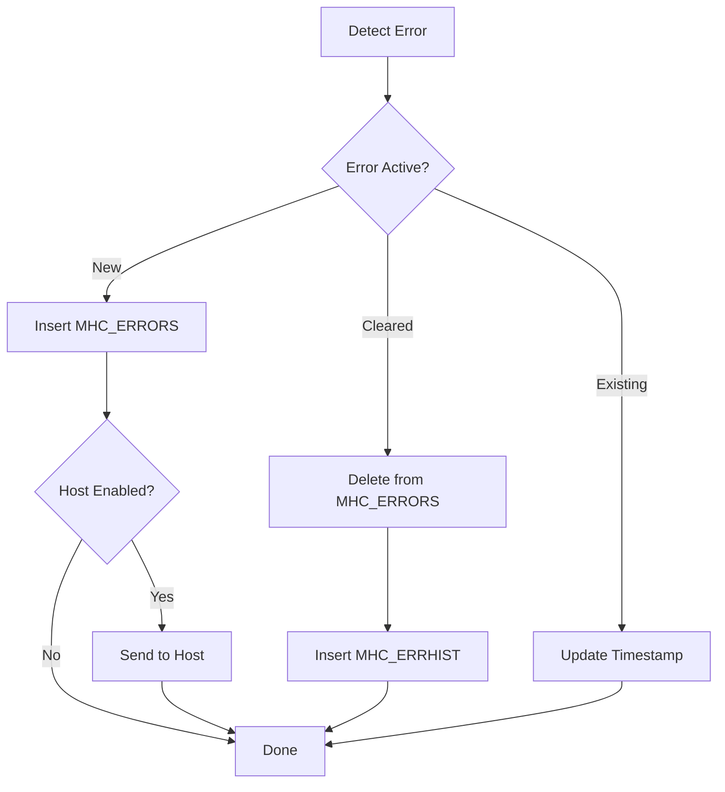

# p_sy_errdev (Error Device Monitor)

**Document Version:** 1.0  
**Last Updated:** 2024-12-23  
**Author:** CmL  
**Source File:** `p_sy_errdev.cpp`  

---

## Overview

The Error Device Monitor (`p_sy_errdev`) is a background process that monitors various system devices for error conditions. It detects hardware and software errors, creates error records, and can notify operators of critical issues.

---

## Purpose

- **Device Monitoring:** Monitor stackers, PLCs, conveyors, and communication status
- **Error Detection:** Detect and log device errors and faults
- **Error Recording:** Create error records in MHC_ERRORS table
- **Error History:** Archive errors to MHC_ERRHIST
- **Andon Support:** Optional integration with Andon systems
- **Host Notification:** Optional error notification to host system

---

## Location

- **Source:** `D:\ICIS\AuroDev\clogan\AuroDev\MSVC Programs\sysc\p_sy_errdev\p_sy_errdev.cpp`
- **Executable:** `D:\Auro\Exec\p_sy_errdev.exe`
- **Lines of Code:** ~1,966

---

## Compile-Time Features

| Feature | Define | Description |
|---------|--------|-------------|
| Robot | `USES_ROBOT` | Include robot monitoring |
| AGV | `USES_AGV` | Include AGV monitoring |
| Host | `USES_HOST` | Enable host notification |
| Andon | `USE_ANDON` | Enable Andon integration |

---

## Device Types Monitored

| Type | Enum Value | Description |
|------|------------|-------------|
| `PLC` | 0 | Programmable Logic Controllers |
| `STACKER` | 1 | Stacker Cranes |
| `STATION` | 2 | Stations/Stands |
| `COMMUNICATIONS` | 3 | Communication Links |
| `AGVX` | 4 | AGV Vehicles |
| `LABELER` | 5 | Label Printers |
| `ROBOT` | 6 | Robots |

---

## Error Customers

| Customer | Description |
|----------|-------------|
| `MHC` | Errors from MHC software |
| `HARDWARE` | Errors from physical equipment |

---

## Process Flow



---

## Key Functions

### main()
```cpp
int main(long argc, char* argv[])
```
**Purpose:** Entry point and main processing loop  
**Flow:**
1. Initialize process
2. Scan all device types for errors
3. Update error database
4. Sleep between cycles

### Stacker Error Monitoring
Monitors stacker cranes for:
- Communication faults
- Hardware errors
- Error codes from equipment
- Offline status

### PLC Error Monitoring
Monitors PLC devices for:
- Specific error bits
- Communication status
- Conveyor section faults
- Discrete alarm bits

### Communication Monitoring
Monitors communication links for:
- Line status changes
- Timeout conditions
- Protocol errors

### Stand Monitoring
Monitors stations/stands for:
- Status changes
- Error conditions
- Load present faults

---

## Configuration Structures

### PLCFields Enum
```cpp
enum PLCFields {
    PLC_INDEX = 1,           // PLC number
    PLC_DEVICE_NAME,         // Device name
    PLC_SECONDARY_TYPE,      // Secondary type code
    PLC_SECONDARY_INDEX,     // Secondary index
    PLC_SECONDARY_NAME,      // Secondary name
    PLC_BIT_NUMBER,          // Bit to monitor
    PLC_CHECK_VALUE,         // Expected value
    PLC_MESSAGE,             // Error message
    PLC_END
};
```

### COMFields Enum
```cpp
enum COMFields {
    COM_DEVICE_NAME = 1,     // Communication device
    COM_LONG_NAME,           // Long description
    COM_MESSAGE,             // Error message
    COM_END
};
```

### AlarmFields Enum
```cpp
enum AlarmFields {
    ALARM_DEVICE_TYPE = 1,   // Device type code
    ALARM_DEVICE_NAME,       // Device identifier
    ALARM_DEVICE_CUST,       // Customer (MHC/HW)
    ALARM_PLC,               // PLC number
    ALARM_BIT,               // Alarm bit
    ALARM_END
};
```

### StatusCheck Enum
```cpp
enum StatusCheck {
    Power_On = 0,
    Operation = 1,
    Stand_By = 2,
    Normal_Stop = 3,
    Setup = 4,
    Abnormality = 5,
    Manual = 6,
    Operation_Preparation_ON = 7,
    TBD = 8
};
```

---

## Dependencies

| Dependency | Type | Purpose |
|------------|------|---------|
| `cc_plc` | Library | PLC interface |
| `cc_str` | Library | String operations |
| `cc_prc` | Library | Process control |
| `cc_gg` | Library | Global variables |
| `cc_sys` | Library | System status |
| `cc_coms` | Library | Communication status |
| `cc_stk` | Library | Stacker interface |
| `cc_std` | Library | Stand interface |
| `cs_elt` | Library | Element tracking |
| `cs_log` | Library | Logging |
| `cs_txt` | Library | Text messages |
| `ds_sql` | Library | Database interface |

---

## Database Tables Accessed

| Table | Operation | Purpose |
|-------|-----------|---------|
| MHC_ERRORS | SELECT, INSERT, UPDATE, DELETE | Active errors |
| MHC_ERRHIST | INSERT | Error history |
| MHC_ERRUSERS | SELECT, INSERT | Error user tracking |
| MHC_ERRQUE | SELECT, INSERT | Error queue |
| MHC_ERRMSG | SELECT | Error messages |

---

## Error Processing Flow



---

## Andon Integration

When `USE_ANDON` is defined:

### AndonError Structure
```cpp
struct AndonError {
    std::string description;  // Error description
    std::string PLCName;      // Associated PLC
    int errorNumber;          // Error code
    int mhcBit;              // MHC bit number
};
```

**Features:**
- Map MHC errors to Andon display codes
- Trigger Andon lights/sounds
- Clear Andon on error resolution

---

## Error Handling

| Error Condition | Handling | Action |
|-----------------|----------|--------|
| Database error | Retry | Log if persistent |
| Device not found | Skip | Log warning |
| Duplicate error | Update timestamp | Don't duplicate |
| Communication timeout | Log error | Create error record |

---

## Related Documents

- [Process Index](00_Process_Index.md)
- [p_sy_erlog](p_sy_erlog.md) - Error Logger
- [ds_errors Module](../03_Shared_Libraries/04_DSUB/ds_errors.md)
- [cc_plc Module](../03_Shared_Libraries/02_CCSUB/cc_plc.md)

---

## Cross-References

| Topic | Document | Section |
|-------|----------|---------|
| Error Table | [Database Reference](../../04_Database_Reference/) | MHC_ERRORS |
| PLC Interface | [cc_plc](../03_Shared_Libraries/02_CCSUB/cc_plc.md) | Bit Access |
| Stacker Interface | [cc_stk](../03_Shared_Libraries/02_CCSUB/cc_stk.md) | Error Status |

---

## Changelog

| Version | Date | Changes |
|---------|------|---------|
| 1.0 | 2024-12-23 | Initial documentation |


