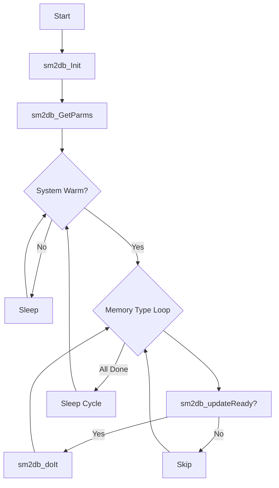

# p_sy_sm2db (Shared Memory to Database)

**Document Version:** 1.0  
**Last Updated:** 2024-12-23  
**Author:** CmL  
**Source File:** `p_sy_sm2db.cpp`  

---

## Overview

The Shared Memory to Database handler (`p_sy_sm2db`) is a background process that synchronizes shared memory objects with their corresponding database tables. When changes are detected in shared memory, it updates the database to maintain consistency.

---

## Purpose

- **Real-Time Sync:** Synchronize shared memory changes to database
- **Multi-Type Support:** Handle various memory types (stackers, stands, processes, etc.)
- **Change Detection:** Only update on actual changes
- **Thick Client Support:** Enable database-based UI updates
- **Table Maintenance:** Clean up stale records

---

## Location

- **Source:** `D:\ICIS\AuroDev\clogan\AuroDev\MSVC Programs\sysc\p_sy_sm2db\p_sy_sm2db.cpp`
- **Executable:** `D:\Auro\Exec\p_sy_sm2db.exe`
- **Lines of Code:** ~1,897

---

## Memory Types

The process supports synchronization of multiple memory types:

| Type | Value | Description |
|------|-------|-------------|
| `Stackers` | 1 | Stacker equipment state |
| `Stands` | 2 | Station/stand state |
| `Points` | 3 | Vehicle navigation points |
| `Zones` | 4 | Zone definitions |
| `AGVs` | 5 | AGV vehicle state |
| `Process` | 6 | Process table |
| `Queues` | 7 | Message queue info |
| `Semaphores` | 8 | Semaphore state |
| `System` | 9 | System parameters |
| `ELT_DAT` | 10 | Element tracking data |
| `COMMS_DAT` | 11 | Communication status |

---

## Process Flow



---

## Key Functions

### main()
```cpp
int main(int argc, char* argv[])
```
**Purpose:** Entry point and main processing loop  
**Flow:**
1. Initialize via `sm2db_Init()`
2. Get configuration parameters
3. Loop through all memory types
4. Update database where changes detected

### sm2db_Init()
```cpp
void sm2db_Init()
```
**Purpose:** Initialize process components  
**Operations:**
1. Common initialization
2. Database connection
3. Initialize memory type handlers
4. Build queue/comms name lists

### sm2db_GetParms()
```cpp
void sm2db_GetParms()
```
**Purpose:** Retrieve configuration from ELEM table  
**Parameters Retrieved:**
| Parameter | Variable | Description |
|-----------|----------|-------------|
| ProcTblUpdate | gProcTableUpdateFrequency | Process table update rate |
| ProcTblClean | gProcTableCleanFrequency | Process table cleanup rate |
| SemTblUpdate | gSemTableUpdateFrequency | Semaphore table update rate |
| SemTblClean | gSemTableCleanFrequency | Semaphore table cleanup rate |
| SysTblUpdate | gSysTableUpdateFrequency | System table update rate |
| ELTTblUpdate | gELTTableUpdateFrequency | ELT table update rate |
| ELTTblClean | gELTTableCleanFrequency | ELT table cleanup rate |
| MMU_Opened | gMappedMemoryUtilityOpened | MMU tool status |
| CommsTblUpdate | gCommsTblUpdateFrequency | Comms table update rate |

### sm2db_doIt()
```cpp
void sm2db_doIt(MEMORY memoryFlg)
```
**Purpose:** Perform sync for specific memory type  
**Parameters:**
| Parameter | Type | Description |
|-----------|------|-------------|
| memoryFlg | MEMORY | Memory type to synchronize |

**Operations:**
1. Get list of items to update
2. Call type-specific handler
3. Update database records

### sm2db_updateReady()
```cpp
bool sm2db_updateReady(MEMORY memoryFlg, vector<string>& outputVector)
```
**Purpose:** Check if update interval has elapsed  
**Returns:** `true` if update needed, populates outputVector with items

### sm2db_Mem2Str()
```cpp
string sm2db_Mem2Str(MEMORY memoryFlg)
```
**Purpose:** Convert memory type enum to string  
**Returns:** Type name string

---

## Type-Specific Handlers

### sm2db_Stacker()
```cpp
long sm2db_Stacker(string primaryKey)
```
**Purpose:** Sync stacker shared memory to MHC_SM2DB_STK table

### sm2db_Stand()
```cpp
long sm2db_Stand(string primaryKey)
```
**Purpose:** Sync stand shared memory to MHC_SM2DB_STATION table

### sm2db_Zones()
```cpp
long sm2db_Zones(string primaryKey)
```
**Purpose:** Sync zone shared memory to database

### sm2db_Process()
```cpp
long sm2db_Process(string primaryKey)
```
**Purpose:** Sync process table shared memory to MHC_PROC_TBL

### sm2db_Queus()
```cpp
long sm2db_Queus(string primaryKey)
```
**Purpose:** Sync queue information to MHC_QUE_TBL

### sm2db_Sems()
```cpp
long sm2db_Sems(string primaryKey)
```
**Purpose:** Sync semaphore state to MHC_SEM_TBL

### sm2db_Sys()
```cpp
long sm2db_Sys(string primaryKey)
```
**Purpose:** Sync system parameters to MHC_SYS

### sm2db_ELT()
```cpp
long sm2db_ELT(string primaryKey)
```
**Purpose:** Sync element tracking data to MHC_ELTDB

### sm2db_Comms()
```cpp
long sm2db_Comms(string primaryKey)
```
**Purpose:** Sync communication status to MHC_COMMS

---

## Dependencies

| Dependency | Type | Purpose |
|------------|------|---------|
| `cc_gg` | Library | Global variables |
| `cc_prc` | Library | Process control |
| `cc_str` | Library | String operations |
| `cc_stk` | Library | Stacker access |
| `cc_std` | Library | Stand access |
| `cc_sys` | Library | System access |
| `cc_common` | Library | Common utilities |
| `cs_func` | Library | Common functions |
| `cs_log` | Library | Logging |
| `cs_tim` | Library | Timers |
| `ds_sql` | Library | Database interface |
| `ds_key` | Library | Key lookups |

---

## Database Tables Accessed

| Table | Operation | Purpose |
|-------|-----------|---------|
| MHC_SM2DB_STK | INSERT, UPDATE | Stacker state |
| MHC_SM2DB_STATION | INSERT, UPDATE | Station state |
| MHC_PROC_TBL | INSERT, UPDATE, DELETE | Process status |
| MHC_QUE_TBL | INSERT, UPDATE | Queue information |
| MHC_SEM_TBL | INSERT, UPDATE, DELETE | Semaphore state |
| MHC_SYS | UPDATE | System parameters |
| MHC_ELTDB | INSERT, UPDATE, DELETE | ELT data |
| MHC_COMMS | INSERT, UPDATE | Communication status |
| MHC_ELEM | SELECT | Configuration |

---

## Global Variables

| Variable | Type | Purpose |
|----------|------|---------|
| gProcTableUpdateFrequency | int | Process update rate (secs) |
| gLastProcessTblUpdate | double | Last process update time |
| gProcTableCleanFrequency | int | Process cleanup rate (secs) |
| gLastProcTblClean | double | Last process cleanup time |
| gSemTableUpdateFrequency | int | Semaphore update rate |
| gLastSemTblUpdate | double | Last semaphore update |
| gSysTableUpdateFrequency | int | System update rate |
| gLastSysTblUpdate | double | Last system update |
| gELTTableUpdateFrequency | int | ELT update rate |
| gCommsTblUpdateFrequency | int | Comms update rate |
| gMappedMemoryUtilityOpened | bool | MMU tool status |
| gSleep_Time | long | Main sleep interval |
| gQuenames | vector | Queue name list |
| gCommsnames | vector | Comms name list |

---

## Update Frequency Logic

Each memory type has independent update frequencies:

```cpp
bool sm2db_updateReady(MEMORY memoryFlg, ...) {
    double currentTime;
    DTM.current(&currentTime);
    
    switch (memoryFlg) {
        case Process:
            if (DTM.diff(currentTime, gLastProcessTblUpdate) >= 
                gProcTableUpdateFrequency) {
                return true;
            }
            break;
        // ... other types
    }
    return false;
}
```

---

## Thick Client Support

This process enables thick client UIs by:
1. Writing real-time equipment state to database
2. Allowing UI to query database instead of shared memory
3. Supporting multiple concurrent UI clients
4. Reducing direct shared memory access

---

## Error Handling

| Error Condition | Handling | Action |
|-----------------|----------|--------|
| Database error | Retry | Log and continue |
| Missing shared memory | Skip item | Log warning |
| Cleanup failure | Log error | Continue processing |
| Update conflict | Retry | Use database lock |

---

## Related Documents

- [Process Index](00_Process_Index.md)
- [p_sy_stats](p_sy_stats.md) - Statistics Collection
- [cs_mpm Module](../03_Shared_Libraries/03_CSUB/cs_mpm.md)
- [cc_mem Module](../03_Shared_Libraries/02_CCSUB/cc_mem.md)

---

## Cross-References

| Topic | Document | Section |
|-------|----------|---------|
| Shared Memory | [cc_mem](../03_Shared_Libraries/02_CCSUB/cc_mem.md) | Memory Operations |
| Process Control | [cc_prc](../03_Shared_Libraries/02_CCSUB/cc_prc.md) | Process Management |
| Database Operations | [ds_sql](../03_Shared_Libraries/04_DSUB/ds_sql.md) | SQL Interface |

---

## Changelog

| Version | Date | Changes |
|---------|------|---------|
| 1.0 | 2024-12-23 | Initial documentation |


