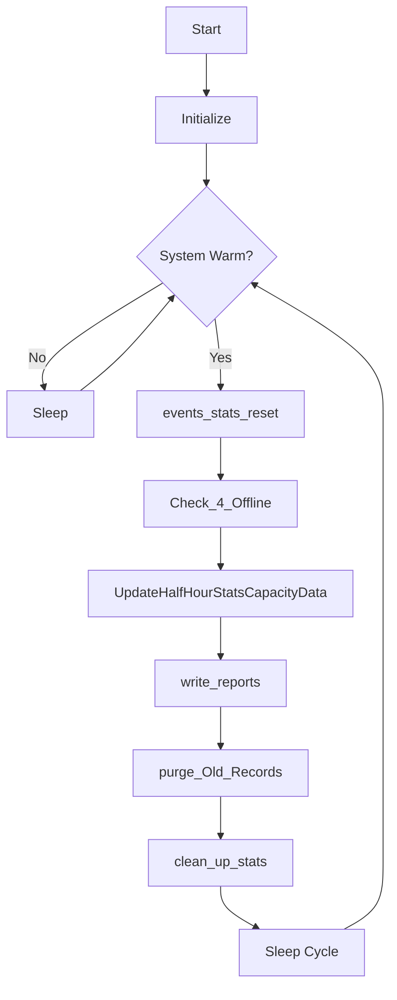

# p_sy_stats (Statistics Collection)

**Document Version:** 1.0  
**Last Updated:** 2024-12-23  
**Author:** CmL  
**Source File:** `p_sy_stats.cpp`  

---

## Overview

The Statistics Collection handler (`p_sy_stats`) is a background process responsible for gathering, calculating, and storing system performance statistics. It tracks equipment utilization, throughput metrics, and operational efficiency on various time intervals.

---

## Purpose

- **Statistics Reset:** Reset statistics counters at configured intervals (shift, daily, weekly, monthly)
- **Statistics Recording:** Capture and store performance metrics to database
- **Capacity Tracking:** Monitor and record storage capacity utilization
- **Report Generation:** Generate statistics reports for analysis
- **Offline Detection:** Monitor devices for offline status
- **Data Purging:** Remove old statistics records beyond retention period

---

## Location

- **Source:** `D:\ICIS\AuroDev\clogan\AuroDev\MSVC Programs\sysc\p_sy_stats\p_sy_stats.cpp`
- **Executable:** `D:\Auro\Exec\p_sy_stats.exe`
- **Lines of Code:** ~3,708

---

## Compile-Time Features

| Feature | Define | Description |
|---------|--------|-------------|
| AGVs | `STAT_USE_AGVS` | Include AGV statistics |
| RTN Vehicles | `STAT_USE_RTNXS` | Include RTN statistics |
| Stackers | `STAT_USE_STACKERS` | Include stacker statistics |
| Stands | `STAT_USE_STANDS` | Include stand statistics |

---

## Process Flow



---

## Key Functions

### main()
```cpp
int main(long argc, char* argv[])
```
**Purpose:** Entry point and main processing loop  
**Flow:**
1. Initialize process and database
2. Main loop on warm start
3. Execute statistics functions periodically
4. Sleep between cycles

### events_stats_reset()
```cpp
void events_stats_reset(double cur_date)
```
**Purpose:** Check and perform statistics resets  
**Parameters:**
| Parameter | Type | Description |
|-----------|------|-------------|
| cur_date | double | Current date/time in julian format |

**Operations:**
1. Check if reset interval reached
2. Process shift changes
3. Reset appropriate counters
4. Archive previous period data

### events_resetstats()
```cpp
void events_resetstats(double cur_date, bool b_Process_Shift, 
                       char cType, char* shift_times)
```
**Purpose:** Perform actual statistics reset  
**Parameters:**
| Parameter | Type | Description |
|-----------|------|-------------|
| cur_date | double | Current timestamp |
| b_Process_Shift | bool | Processing shift change |
| cType | char | Statistics type code |
| shift_times | char* | Shift time definitions |

### insert_stats()
```cpp
long insert_stats(CS_STS_REPORT* my_stat, char* name, char* type, 
                  char* area, double cur_date, char stat_type,
                  bool endOfWeek, bool lastWeekOfYear, char* shift_times)
```
**Purpose:** Insert statistics record into database  
**Parameters:**
| Parameter | Type | Description |
|-----------|------|-------------|
| my_stat | CS_STS_REPORT* | Statistics structure |
| name | char* | Device name |
| type | char* | Device type |
| area | char* | Area/aisle |
| cur_date | double | Timestamp |
| stat_type | char | Period type (H/D/W/M) |

### process_type()
```cpp
long process_type(CS_STS_REPORT* my_stat, char* name, char* type,
                  char* area, double cur_date, bool endOfWeek,
                  bool lastWeekOfYear, char* shift_times)
```
**Purpose:** Process statistics by device type  
**Returns:** GP.GOOD on success

### purge_Old_Records()
```cpp
void purge_Old_Records(double cur_date)
```
**Purpose:** Delete statistics records beyond retention period  
**Operations:**
1. Calculate purge date threshold
2. Delete records older than threshold
3. Log purge counts

### clean_up_stats()
```cpp
void clean_up_stats(double cur_date, double last_run_time)
```
**Purpose:** Clean up orphaned or incomplete statistics records

### write_reports()
```cpp
void write_reports(double cur_date)
```
**Purpose:** Generate statistics report files  
**Output:** CSV or text files in configured directory

### Check_4_Offline()
```cpp
void Check_4_Offline()
```
**Purpose:** Monitor devices for offline status  
**Operations:**
1. Scan all configured devices
2. Check communication status
3. Update offline counters

---

## Capacity Statistics

### UpdateHalfHourStatsCapacityData()
```cpp
void UpdateHalfHourStatsCapacityData()
```
**Purpose:** Update half-hour capacity statistics  
**Metrics Collected:**
- Total location count
- Storable location count
- Capacity utilization percentage

### GetHalfHourAisleCapcityData()
```cpp
long GetHalfHourAisleCapcityData(STATS& stat)
```
**Purpose:** Get capacity data by aisle for half-hour period

### GetAvgCapcityData()
```cpp
long GetAvgCapcityData(STATS& stat, bool doingInsert)
```
**Purpose:** Calculate average capacity over period

---

## Data Structures

### CapacitySample
```cpp
struct CapacitySample {
    std::string sampleTime;      // Sample timestamp
    int         allLocnCnt;      // Total locations
    int         storableLocnCnt; // Storable locations
    double      capacityUsedPct; // Utilization %
};
```

### StatNeedingHalf
```cpp
struct StatNeedingHalf {
    std::string deviceName;   // Device identifier
    std::string statPeriod;   // Period being processed
};
```

### CS_STS_REPORT
```cpp
// Statistics report structure (from cc_sts.h)
struct CS_STS_REPORT {
    long stores;           // Store count
    long retrieves;        // Retrieve count
    long transfers;        // Transfer count
    double busy_time;      // Time in busy state
    double idle_time;      // Time in idle state
    double error_time;     // Time in error state
    // ... additional fields
};
```

---

## Statistics Periods

| Period | Code | Description |
|--------|------|-------------|
| Half-Hour | H | 30-minute intervals |
| Shift | S | Shift-based periods |
| Daily | D | 24-hour periods |
| Weekly | W | 7-day periods |
| Monthly | M | Calendar month |
| Yearly | Y | Calendar year |

---

## Dependencies

| Dependency | Type | Purpose |
|------------|------|---------|
| `cc_gg` | Library | Global variables |
| `cc_str` | Library | String operations |
| `cc_prc` | Library | Process control |
| `cc_sys` | Library | System status |
| `cc_plc` | Library | PLC interface |
| `cc_stk` | Library | Stacker statistics |
| `cc_std` | Library | Stand statistics |
| `cc_sts` | Library | Statistics structures |
| `cc_bcrx` | Library | Barcode reader stats |
| `cc_wei` | Library | Weight scale stats |
| `cs_dtm` | Library | Date/time functions |
| `cs_elt` | Library | Element table |
| `cs_reg` | Library | Registry access |
| `ds_sql` | Library | Database interface |
| `ds_stats_info` | Library | Statistics helpers |

---

## Database Tables Accessed

| Table | Operation | Purpose |
|-------|-----------|---------|
| MHC_STATS | SELECT, INSERT, UPDATE, DELETE | Statistics storage |
| MHC_STATS_STATCONT | SELECT, INSERT | Statistics container |
| MHC_ERRORS | SELECT | Error counts |
| MHC_ERRHIST | SELECT | Error history |
| MHC_ELEM | SELECT | Configuration |

---

## Configuration

| Variable | Source | Description |
|----------|--------|-------------|
| msLogDir | Registry | Log file directory |
| msArcDir | Registry | Archive directory |
| Shift times | ELEM | Shift definitions |
| Retention | ELEM | Data retention period |

---

## Report Output

Reports can be generated in the following formats:
- CSV files for spreadsheet import
- Text files for logging
- Database records for UI display

### Report Location
```
D:\Auro\Reports\Stats\
├── Daily\
├── Weekly\
├── Monthly\
└── Archive\
```

---

## Time Checking Functions

| Function | Purpose |
|----------|---------|
| `checkWeeklyTimestamp()` | Check if weekly rollover due |
| `checkMonthlyTimeStamp()` | Check if monthly rollover due |
| `checkYearlyTimeStamp()` | Check if yearly rollover due |

---

## Error Handling

| Error Condition | Handling | Action |
|-----------------|----------|--------|
| Database error | Retry | Log if persistent |
| Missing device | Skip | Continue to next |
| Invalid timestamp | Reset | Use current time |
| Report write failure | Log error | Continue processing |

---

## Related Documents

- [Process Index](00_Process_Index.md)
- [p_ar_events](p_ar_events.md) - Events Handler
- [p_sy_sm2db](p_sy_sm2db.md) - Shared Memory to DB
- [cc_sts Module](../03_Shared_Libraries/02_CCSUB/)

---

## Cross-References

| Topic | Document | Section |
|-------|----------|---------|
| Statistics Table | [Database Reference](../../04_Database_Reference/) | MHC_STATS |
| Date/Time | [cs_dtm](../03_Shared_Libraries/03_CSUB/cs_dtm.md) | Conversions |
| Registry | [cs_reg](../03_Shared_Libraries/03_CSUB/cs_reg.md) | Configuration |

---

## Changelog

| Version | Date | Changes |
|---------|------|---------|
| 1.0 | 2024-12-23 | Initial documentation |


