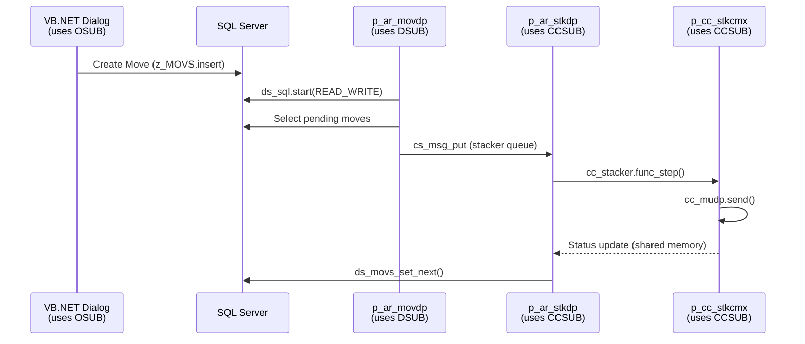
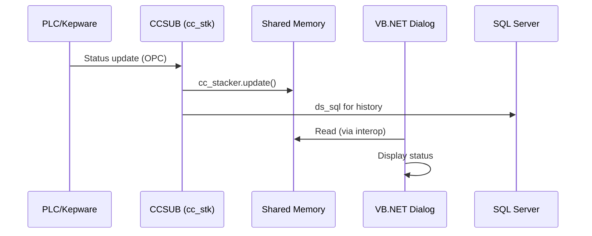

# SUB Library Relationships

**Document Version:** 1.0  
**Last Updated:** 2024-12-23  
**Author:** CmL  
**Confidence Score:** 0.95

---

## Overview

This document maps the relationships, dependencies, and data flows between the four core SUB libraries in the MHC/MEM system:

- **OSUB** - VB.NET database access (generated)
- **DSUB** - C++ database subroutines
- **CCSUB** - Common control subroutines
- **CSUB** - Common utility subroutines

---

## Dependency Matrix

### Library Dependencies

```
                    ┌─────────────────────────────────────────────────────────┐
                    │                    DEPENDENCY MATRIX                    │
                    │                                                         │
                    │       Used By →                                         │
                    │  Uses ↓   │ OSUB │ DSUB │ CCSUB │ CSUB │ Processes │    │
                    ├───────────┼──────┼──────┼───────┼──────┼───────────┤    │
                    │ OSUB      │  -   │  ✗   │   ✗   │  ✗   │    VB     │    │
                    │ DSUB      │  ✗   │  -   │   ✓   │  ✓   │   C++     │    │
                    │ CCSUB     │  ✗   │  ✓   │   -   │  ✓   │   C++     │    │
                    │ CSUB      │  ✗   │  ✓   │   ✓   │  -   │   C++     │    │
                    │ global_prm│  ✗   │  ✓   │   ✓   │  ✓   │   C++     │    │
                    │ ICISDefines│ ✓   │  ✗   │   ✗   │  ✗   │    VB     │    │
                    └───────────┴──────┴──────┴───────┴──────┴───────────┘

                    Legend: ✓ = Depends on, ✗ = Does not depend on
```

### Detailed Dependencies

| Library | Depends On | Required Headers |
|---------|------------|-----------------|
| **DSUB** | CCSUB, CSUB, global_prm.h | `<cc_gg.h>`, `<cc_str.h>`, `<cs_log.h>`, `<cs_dtm.h>` |
| **CCSUB** | CSUB, global_prm.h | `<cs_log.h>`, `<cs_reg.h>`, `<cs_elt.h>`, `<cs_msg.h>` |
| **CSUB** | global_prm.h | `<global_prm.h>` |
| **OSUB** | ICISDefines.vb | `ICISDefines.vb` |

---

## Architecture Diagram

```
┌─────────────────────────────────────────────────────────────────────────────┐
│                            APPLICATION LAYER                                 │
│  ┌─────────────────────────────┐   ┌─────────────────────────────────────┐  │
│  │     VB.NET UI Dialogs       │   │     C++ Background Processes        │  │
│  │   (frm_Store, frm_MoveInq)  │   │   (p_ar_movdp, p_ar_stkdp, etc.)    │  │
│  └──────────────┬──────────────┘   └─────────────────┬───────────────────┘  │
│                 │                                     │                      │
└─────────────────┼─────────────────────────────────────┼──────────────────────┘
                  │                                     │
                  ▼                                     ▼
┌─────────────────────────────────┐   ┌────────────────────────────────────────┐
│           OSUB Layer            │   │              DSUB Layer                │
│    (VB.NET Generated Classes)   │   │    (C++ Database Subroutines)         │
│                                 │   │                                        │
│  ┌───────────────────────────┐  │   │  ┌────────────────────────────────┐   │
│  │ z_MOVS  z_LOAD  z_INVT    │  │   │  │ ds_sql    ds_movs   ds_stand  │   │
│  │ z_LOCN  z_ORDER z_STAK    │  │   │  │ ds_sr     ds_group  ds_get_*  │   │
│  └───────────────────────────┘  │   │  └────────────────────────────────┘   │
│         Uses ↓                  │   │         Uses ↓                        │
│  ┌───────────────────────────┐  │   │  ┌────────────────────────────────┐   │
│  │    ICISDefines.vb         │  │   │  │  CCSUB (cc_str, cc_gg, etc.)   │   │
│  │    (Constants/Enums)      │  │   │  │  CSUB (cs_log, cs_msg, etc.)   │   │
│  └───────────────────────────┘  │   │  └────────────────────────────────┘   │
└─────────────────────────────────┘   └────────────────────────────────────────┘
                  │                                     │
                  │         ┌───────────────────────────┘
                  ▼         ▼
┌─────────────────────────────────────────────────────────────────────────────┐
│                           CCSUB Layer                                        │
│                 (Common Control Subroutines)                                 │
│  ┌──────────────────────────────────────────────────────────────────────┐   │
│  │   cc_stk (Stackers)    cc_std (Stands)     cc_zone (Zones)           │   │
│  │   cc_agv (AGVs)        cc_rtn (RTNs)       cc_plc (PLCs)             │   │
│  │   cc_str (Strings)     cc_gg (Globals)     cc_mem (Memory)           │   │
│  │   cc_mudp (Protocol)   cc_vehicle (Base)   cc_sys (System)           │   │
│  └──────────────────────────────────────────────────────────────────────┘   │
│                              Uses ↓                                          │
└───────────────────────────────┬─────────────────────────────────────────────┘
                                │
                                ▼
┌─────────────────────────────────────────────────────────────────────────────┐
│                           CSUB Layer                                         │
│                   (Common Utility Subroutines)                               │
│  ┌──────────────────────────────────────────────────────────────────────┐   │
│  │   cs_log (Logging)     cs_msg (Messaging)    cs_reg (Registry)       │   │
│  │   cs_dtm (DateTime)    cs_elt (Elements)     cs_err (Errors)         │   │
│  │   cs_sem (Semaphores)  cs_txt (Text)         cs_tmr (Timers)         │   │
│  │   cs_mpm (MappedMem)   cs_cnf (Config)       cs_seq (Sequences)      │   │
│  └──────────────────────────────────────────────────────────────────────┘   │
│                              Uses ↓                                          │
└───────────────────────────────┬─────────────────────────────────────────────┘
                                │
                                ▼
┌─────────────────────────────────────────────────────────────────────────────┐
│                        FOUNDATION LAYER                                      │
│  ┌─────────────────────────────┐   ┌─────────────────────────────────────┐  │
│  │      global_prm.h           │   │         ICISDefines.vb              │  │
│  │   (C++ Constants/Macros)    │   │      (VB.NET Constants/Enums)       │  │
│  └─────────────────────────────┘   └─────────────────────────────────────┘  │
│                 │                                     │                      │
│                 └──────────── MUST MATCH ─────────────┘                      │
└─────────────────────────────────────────────────────────────────────────────┘
                                │
                                ▼
┌─────────────────────────────────────────────────────────────────────────────┐
│                    DATABASE / HARDWARE LAYER                                 │
│  ┌────────────────────────────────┐   ┌─────────────────────────────────┐   │
│  │  Microsoft SQL Server          │   │  Shared Memory Files (.shm)     │   │
│  │  (MHC_MOVS, MHC_LOAD, etc.)    │   │  (Equipment State)              │   │
│  └────────────────────────────────┘   └─────────────────────────────────┘   │
│  ┌────────────────────────────────┐   ┌─────────────────────────────────┐   │
│  │  Kepware OPC Server            │   │  Log Files / Config Files       │   │
│  │  (PLC Communication)           │   │  (*.log, *.cnf, *.xml)          │   │
│  └────────────────────────────────┘   └─────────────────────────────────┘   │
└─────────────────────────────────────────────────────────────────────────────┘
```

---

## Data Flow Patterns

### 1. Move Processing Flow



### 2. Equipment Status Flow



---

## Function Call Patterns

### VB.NET to Database (OSUB Pattern)

```vb
' VB.NET Dialog using OSUB generated classes
Dim movs As New z_MOVS()
movs.LOAD_ID = loadId
movs.STATUS = ICISDefines.MOVS.STATUS.PEND

If movs.insert() = ICISDefines.GP.GOOD Then
    ' Success
Else
    ' Error handling
End If
```

### C++ to Database (DSUB Pattern)

```cpp
// C++ Process using DSUB
SQL.start(SQL.READ_WRITE);

MOVS movs;
cc_str.copy(movs.LOAD_ID, loadId, sizeof(movs.LOAD_ID));
movs.STATUS = GP.MOVS.STATUS.PEND();

if (movs_insert(&movs) != GP.GOOD) {
    SQL.rollback();
    return GP.BAD;
}

SQL.commit();
```

### Cross-Library Pattern (Typical C++ Process)

```cpp
// Includes showing library relationships
#include <global_prm.h>    // Foundation
#include <cc_gg.h>         // CCSUB - Global variables
#include <cc_str.h>        // CCSUB - String operations
#include <cc_stk.h>        // CCSUB - Stacker control
#include <cs_log.h>        // CSUB - Logging
#include <cs_msg.h>        // CSUB - Messaging
#include <ds_sql.h>        // DSUB - Database

// Initialization uses CSUB
cs_init("p_ar_movdp", GP.PRC.SYSTM, area);

// Logging uses CSUB
cs_log_printf(gg.prgnam(), 3, "Starting dispatcher");

// Equipment access uses CCSUB
cc_stacker* SR = cc_stacker_ctrl.Find_Stk("SR01");
if (SR->ok()) {
    // Database access uses DSUB
    SQL.start(SQL.READ_WRITE);
    ds_movs_set_next(&movs, GP.MOVS.STATUS.ACTV());
    SQL.commit();
}
```

---

## Key Integration Points

### 1. String Operations (CRITICAL)

**ALL string operations in C++ MUST use `cc_str`:**

```cpp
// CORRECT
cc_str.copy(dest, source, sizeof(dest));
cc_str.comp(str1, str2);
cc_str.cat(dest, source, sizeof(dest));

// FORBIDDEN - Never use C library directly
// strcpy(dest, source);   // NEVER!
// strcmp(str1, str2);     // NEVER!
// strcat(dest, source);   // NEVER!
```

### 2. Constants Synchronization

`global_prm.h` and `ICISDefines.vb` MUST be synchronized:

| Constant Type | C++ | VB.NET |
|---------------|-----|--------|
| Move Status | `GP.MOVS.STATUS.PEND()` | `ICISDefines.MOVS.STATUS.PEND` |
| Stand Mode | `GP.ST.MODES.STORE` | `ICISDefines.ST.MODES.STORE` |
| Return Codes | `GP.GOOD` | N/A (use standard VB) |

### 3. Database Transaction Flow

```cpp
// Standard DSUB transaction pattern
SQL.connect();                    // Connect once at startup
SQL.start(SQL.READ_WRITE);        // Begin transaction
// ... database operations ...
SQL.commit();                     // or SQL.rollback();
```

### 4. Message Queue Flow

```cpp
// CSUB message queue pattern
// Sender
cs_msg_put("STACKER_Q", &msg, 0, 1);  // Put and wake receiver

// Receiver
if (cs_msg_get("STACKER_Q", &msg) == GP.GOOD) {
    // Process message
}
```

---

## Library Responsibilities

| Library | Primary Responsibility | Key Classes/Functions |
|---------|----------------------|----------------------|
| **OSUB** | VB.NET database access | `z_MOVS`, `z_LOAD`, `z_INVT` |
| **DSUB** | C++ database operations | `SQL`, `ds_movs_*`, `ds_stand_*` |
| **CCSUB** | Equipment control | `cc_stacker`, `cc_stand`, `cc_zone` |
| **CSUB** | Utility functions | `cs_log_*`, `cs_msg_*`, `cs_dtm_*` |

---

## Build Order

Libraries must be built in dependency order:

1. **CSUB** (no dependencies)
2. **CCSUB** (depends on CSUB)
3. **DSUB** (depends on CCSUB, CSUB)
4. **OSUB** (independent VB.NET, generated)

---

## Related Documentation

- [OSUB Library](osub.md)
- [DSUB Library](dsub.md)
- [CCSUB Library](ccsub.md)
- [CSUB Library](csub.md)
- [global_prm.h Reference](global_prm.md)
- [ICISDefines.vb Reference](ICISDefines.md)

---

## Changelog

| Version | Date | Changes |
|---------|------|---------|
| 1.0 | 2024-12-23 | Initial creation |

